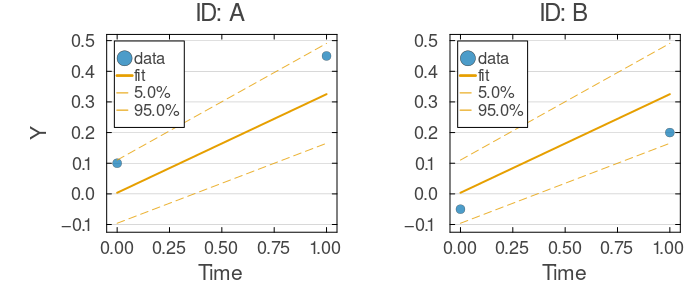
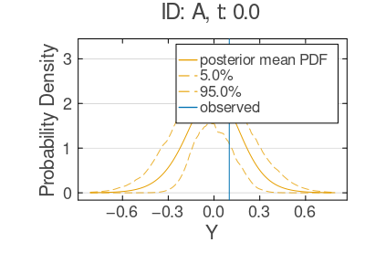

# Fixed-Effects Tutorial 2: Variational Inference (VI)

This tutorial shows a complete fixed-effects Bayesian workflow with `VI` in NoLimits.jl: model specification, fitting, variational diagnostics, posterior sampling, chain-style UQ, and plotting.

## What You Will Learn

- How to fit a fixed-effects model with `NoLimits.VI`.
- How to inspect VI-specific outputs (`trace`, `state`, posterior object).
- How to sample posterior draws from the variational approximation.
- How to run `compute_uq(...; method=:chain)` for VI.

## Step 1: Build a Small Fixed-Effects Dataset

```julia
using NoLimits
using DataFrames
using Distributions
using Random

Random.seed!(123)

df = DataFrame(
    ID = [:A, :A, :B, :B, :C, :C, :D, :D],
    t = [0.0, 1.0, 0.0, 1.0, 0.0, 1.0, 0.0, 1.0],
    y = [0.10, 0.45, -0.05, 0.20, 0.00, 0.33, -0.08, 0.26],
)
```

## Step 2: Define the Model

```julia
model = @Model begin
    @covariates begin
        t = Covariate()
    end

    @fixedEffects begin
        a = RealNumber(0.0, prior=Normal(0.0, 1.0))
        b = RealNumber(0.3, prior=Normal(0.0, 1.0))
        sigma = RealNumber(0.2, scale=:log, prior=LogNormal(-1.5, 0.3))
    end

    @formulas begin
        y ~ Normal(a + b * t, sigma)
    end
end

dm = DataModel(model, df; primary_id=:ID, time_col=:t)
```

## Step 3: Fit with VI

```julia
res_vi = fit_model(
    dm,
    VI(; turing_kwargs=(max_iter=350, family=:meanfield, progress=false)),
    rng=Random.Xoshiro(10),
)
```

## Step 4: Inspect VI Outputs

```julia
objective = get_objective(res_vi)     # final ELBO
converged = get_converged(res_vi)
trace = get_vi_trace(res_vi)
state = get_vi_state(res_vi)
posterior = get_variational_posterior(res_vi)

fit_summary = NoLimits.summarize(res_vi)
fit_summary
```

```
FitResultSummary
════════════════════════════════════════════════════════════════════════════════════════════════
Overview
  method                              : vi
  inference                           : bayesian
  scale                               : natural
  objective                           : -0.7632
  iterations                          : missing
  parameters shown (reported / total) : 3 / 3

Parameter estimates
  parameter      Estimate
  -----------------------
  a               -0.0085
  b                0.3152
  sigma            0.1681

Outcome data coverage
  outcome       n_obs   n_missing
  -------------------------------
  y                 8           0
  TOTAL             8           0
```

## Step 5: Sample Posterior Draws from the Variational Posterior

```julia
draws_named = sample_posterior(
    res_vi;
    n_draws=200,
    rng=Random.Xoshiro(11),
    return_names=true,
)

size(draws_named.draws), first(draws_named.names, 3)
```

```
((200, 3), [:a, :b, :sigma])
```

## Step 6: Compute UQ Intervals from VI Draws

For VI fits, use `method=:chain`. Internally, NoLimits samples from the variational posterior.

```julia
uq_vi = compute_uq(
    res_vi;
    method=:chain,
    level=0.95,
    mcmc_draws=150,
    rng=Random.Xoshiro(12),
)

uq_summary = NoLimits.summarize(res_vi, uq_vi)
uq_summary
```

```
UQResultSummary
════════════════════════════════════════════════════════════════════════════════════════════════
Overview
  backend                             : chain
  source_method                       : vi
  inference                           : bayesian
  scale                               : natural
  objective                           : -0.7632
  interval level                      : 0.95
  parameters shown (reported / total) : 3 / 3

Parameter uncertainty summary
  parameter      Estimate     CrI Lower     CrI Upper
  -------------------------------------
  a               -0.0112       -0.1137        0.0907
  b                 0.312        0.1709        0.4618
  sigma            0.1746        0.1164        0.2696

Outcome data coverage
  outcome       n_obs   n_missing
  -------------------------------
  y                 8           0
  TOTAL             8           0
```

## Step 7: Posterior-Based Plotting

The same plotting APIs used for MCMC also work for VI posterior draws.

```julia
p_fit_vi = plot_fits(
    res_vi;
    observable=:y,
    individuals_idx=[1, 2],
    ncols=2,
    plot_mcmc_quantiles=true,
    mcmc_draws=120,
    rng=Random.Xoshiro(13),
)

p_obs_vi = plot_observation_distributions(
    res_vi;
    observables=:y,
    individuals_idx=1,
    obs_rows=1,
    mcmc_draws=120,
    rng=Random.Xoshiro(14),
)
```

Fit plot:

```julia
p_fit_vi
```



Observation distribution plot:

```julia
p_obs_vi
```



## Summary

You now have a complete fixed-effects VI workflow:

- Bayesian fitting with `VI`.
- Access to optimization trace/state and posterior sampler.
- Posterior intervals through `compute_uq(...; method=:chain)`.
- Posterior-aware predictive and observation-level plots.
