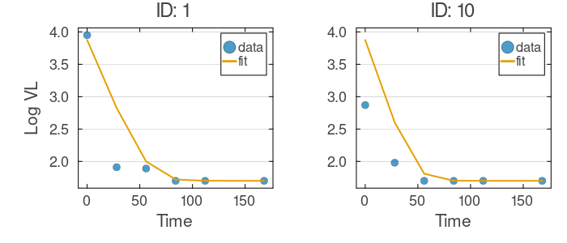
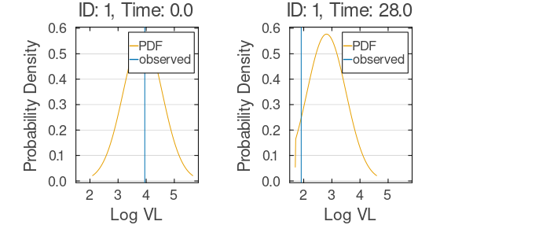
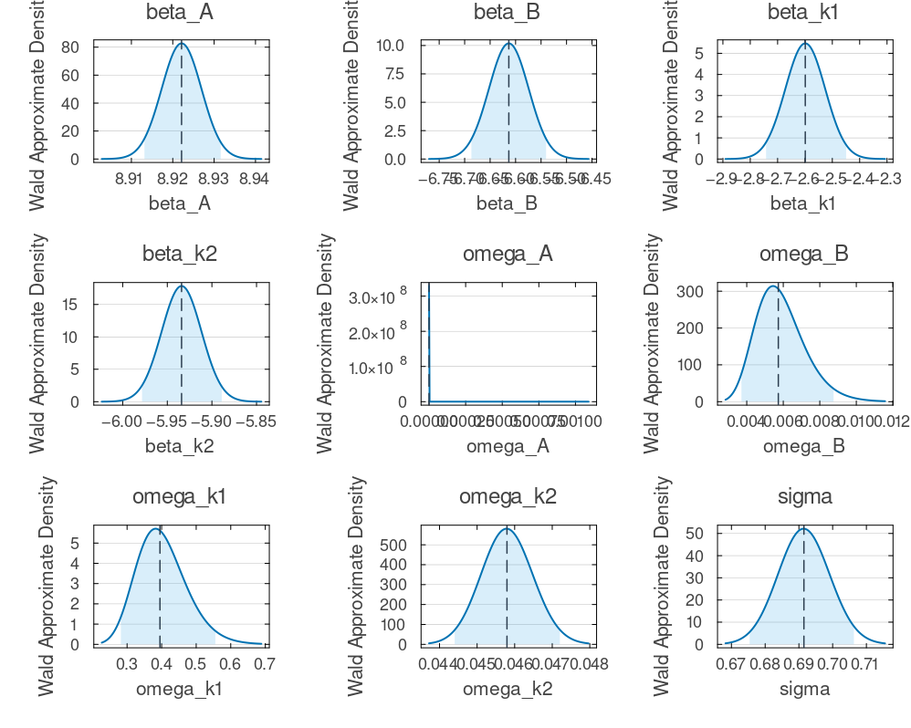

# Mixed-Effects Tutorial 6: Left-Censored Nonlinear Model (Laplace)

In many biomedical assays, measurements below the lower limit of quantification (LLOQ) are *left-censored*: the value is known only to lie below a threshold. HIV viral load is the canonical case — assays report "undetectable" below ~50 copies/mL (≈1.7 on the log10 scale), and 30–40% of measurements can be censored in well-treated patients. Dropping these rows or substituting the limit biases estimates; the principled fix is a *censored likelihood*, where uncensored points contribute their density and censored points the cumulative probability of falling below the limit. This tutorial fits a bi-exponential decay model (fast then slow viral decline) to the `virload50` dataset (50 patients), with `LogNormal` random effects making it nonlinear in the random effects, using NoLimits' `censored(...)` syntax and the Laplace approximation.

If your outcome is a discrete observed-state Markov model with ambiguous/set-valued state
labels, use `coarsed(...)` instead of `censored(...)`. See the formulas documentation:
[`Example: Coarsed Observed-State Markov Model`](../model-building/formulas.md#example-coarsed-observed-state-markov-model).

## Learning Goals

- Flag left-censored observations and pin them at the detection limit.
- Specify `LogNormal` random effects driving a bi-exponential mean.
- Encode left-censoring with `censored(Normal(mu, sigma), lower=1.7, upper=Inf)`.
- Estimate with Laplace, and diagnose with fits, observation distributions, and Wald intervals.

## Step 1: Data Setup

The `virload50` dataset has four columns: `ID`, `Time`, log10 viral load `Log_VL`, and a censoring flag `cens` (1 at or below the detection limit of 1.7). We enforce types and sort by subject and time; the printed summary reports the dataset size and the censored fraction.

```julia
using NoLimits
using CSV
using DataFrames
using Distributions
using Downloads
using Random
using SciMLBase

include(joinpath(@__DIR__, "_data_loaders.jl"))

Random.seed!(2026)

df = load_virload50()
select!(df, [:ID, :Time, :Log_VL, :cens])
df.ID = string.(df.ID)
df.Time = Float64.(df.Time)
df.Log_VL = Float64.(df.Log_VL)
df.cens = Int.(df.cens)
sort!(df, [:ID, :Time])

(
    n_rows = nrow(df),
    n_subjects = length(unique(df.ID)),
    n_censored = count(==(1), df.cens),
)
```

<!- injected:t6-data ->
```text
(n_rows = 300, n_subjects = 50, n_censored = 131)
```

## Step 2: Define the Nonlinear Left-Censored Mixed-Effects Model

The bi-exponential decay captures two phases of viral dynamics — rapid initial clearance, then slower decline. For subject $i$ at time $t$:

```math
V_i(t) = A_i e^{-k_{1,i} t} + B_i e^{-k_{2,i} t},
\qquad \mu_{it} = \log_{10}(V_i(t)).
```

Each subject parameter ($A_i$, $B_i$, $k_{1,i}$, $k_{2,i}$) is `LogNormal`, keeping amplitudes and rates positive; the fixed effects (`beta_A`, `beta_B`, `beta_k1`, `beta_k2`) are population log-medians and the `omega` parameters set the between-subject spread.

`censored(Normal(mu, sigma), lower=1.7, upper=Inf)` does the rest: above 1.7 an observation contributes the Normal density, and at the pinned value 1.7 it contributes the cumulative probability $\Phi\bigl((1.7 - \mu) / \sigma\bigr)$ that the true value lies below the limit. This is statistically exact, unlike imputation or deletion (see [formulas](../model-building/formulas.md)).

```julia
model = @Model begin
    @covariates begin
        Time = Covariate()
    end

    @fixedEffects begin
        beta_A = RealNumber(9.9, calculate_se=true)
        beta_B = RealNumber(5.0, calculate_se=true)
        beta_k1 = RealNumber(-1.9, calculate_se=true)
        beta_k2 = RealNumber(-5.3, calculate_se=true)

        omega_A = RealNumber(0.40, scale=:log, calculate_se=true)
        omega_B = RealNumber(0.40, scale=:log, calculate_se=true)
        omega_k1 = RealNumber(0.40, scale=:log, calculate_se=true)
        omega_k2 = RealNumber(0.40, scale=:log, calculate_se=true)

        sigma = RealNumber(0.25, scale=:log, calculate_se=true)
    end

    @randomEffects begin
        A_i = RandomEffect(LogNormal(beta_A, omega_A); column=:ID)
        B_i = RandomEffect(LogNormal(beta_B, omega_B); column=:ID)
        k1_i = RandomEffect(LogNormal(beta_k1, omega_k1); column=:ID)
        k2_i = RandomEffect(LogNormal(beta_k2, omega_k2); column=:ID)
    end

    @formulas begin
        V_i = A_i * exp(-k1_i * Time) + B_i * exp(-k2_i * Time)
        mu = log10(V_i)

        Log_VL ~ censored(Normal(mu, sigma), lower=1.7, upper=Inf)
    end
end

NoLimits.summarize(model)
```

<!- injected:t6-model ->
```text
ModelSummary
════════════════════════════════════════════════════════════════════════════════════════════════
Overview
  model type                          : non-ODE
  fixed-effect blocks                 : 9
  fixed-effect scalar values          : 9
  random effects                      : 4
  random-effect grouping columns      : 1
  covariates (declared)               : 1
  formulas (deterministic / outcomes) : 2 / 1
  requires DE accessors               : false

Structure blocks
  helpers              : false
  fixed effects        : true
  random effects       : true
  covariates           : true
  preDE                : false
  DifferentialEquation : false
  initialDE            : false

Covariate classes
  varying  : 1
  constant : 0
  dynamic  : 0

Fixed-effects declarations
  name      type        size  se  prior      scale     bounds                              details
  -------------------------------------------------------------------------------------------------------------
  beta_A    RealNumber     1  yes  Priorless  identity  finite lower 0/1, finite upper 0/1  -
  beta_B    RealNumber     1  yes  Priorless  identity  finite lower 0/1, finite upper 0/1  -
  beta_k1   RealNumber     1  yes  Priorless  identity  finite lower 0/1, finite upper 0/1  -
  beta_k2   RealNumber     1  yes  Priorless  identity  finite lower 0/1, finite upper 0/1  -
  omega_A   RealNumber     1  yes  Priorless  log       finite lower 1/1, finite upper 0/1  -
  omega_B   RealNumber     1  yes  Priorless  log       finite lower 1/1, finite upper 0/1  -
  omega_k1  RealNumber     1  yes  Priorless  log       finite lower 1/1, finite upper 0/1  -
  omega_k2  RealNumber     1  yes  Priorless  log       finite lower 1/1, finite upper 0/1  -
  sigma     RealNumber     1  yes  Priorless  log       finite lower 1/1, finite upper 0/1  -

Random-effects declarations
  name  group  dist     
  ------------------------
  A_i   ID     LogNormal
  B_i   ID     LogNormal
  k1_i  ID     LogNormal
  k2_i  ID     LogNormal

Covariate declarations
  name  kind       columns                   constant_on           interpolation
  ---------------------------------------------------------------------------------------
  Time  Covariate  Time                      -                     -

Formulas
  deterministic names : V_i, mu
  outcome names       : Log_VL
  required DE states  : (none)
  required DE signals : (none)
  declared DE states  : (none)
  declared DE signals : (none)
Outcome distribution types
  Log_VL => censored

Helper functions
  names : (none)
```

## Step 3: Build `DataModel` and Configure `Laplace`

After building the `DataModel`, we configure Laplace, which integrates out the random effects with a second-order expansion around each subject's empirical-Bayes mode (see [Laplace](../estimation/laplace.md)). `inner_kwargs` controls the per-subject random-effects optimization and `optim_kwargs` the outer fixed-effects optimization; multistart is off here for speed.

```julia
dm = DataModel(model, df; primary_id=:ID, time_col=:Time)

laplace_method = NoLimits.Laplace(;
    optim_kwargs=(maxiters=400,),
    inner_kwargs=(maxiters=150,),
    multistart_n=0,
    multistart_k=0,
)

serialization = SciMLBase.EnsembleThreads()

NoLimits.summarize(dm)
```

<!- injected:t6-dm ->
```text
DataModelSummary
════════════════════════════════════════════════════════════════════════════════════════════════
Overview
  model type                 : non-ODE
  event-aware                : false
  individuals                : 50
  rows (total / obs / event) : 300 / 300 / 0
  fixed effects (top-level)  : 9
  outcomes                   : 1
  covariates (declared)      : 1
  random effects             : 4

Covariate classes
  varying  : 1
  constant : 0
  dynamic  : 0

Outcome distribution types
  Log_VL => censored

Random-effect distribution types
  A_i  => LogNormal
  B_i  => LogNormal
  k1_i => LogNormal
  k2_i => LogNormal

Individual design diagnostics
  individuals with one observation              : 0
  global observed time range                    : 0.0 to 168.0
  unique observed time points                   : 6
  duplicate (ID, time) observation rows         : 0
  monotonic-time violations (observation order) : 0

Observations per individual
  metric       n          mean            sd           min           q25        median           q75           max
  ----------------------------------------------------------------------------------------------------------------
  count       50           6.0           0.0           6.0           6.0           6.0           6.0           6.0

Time span per individual
  metric       n          mean            sd           min           q25        median           q75           max
  ----------------------------------------------------------------------------------------------------------------
  span        50         168.0           0.0         168.0         168.0         168.0         168.0         168.0

Median sampling interval per individual
  metric          n          mean            sd           min           q25        median           q75           max
  -------------------------------------------------------------------------------------------------------------------
  median_dt      50          28.0           0.0          28.0          28.0          28.0          28.0          28.0

Outcome descriptive statistics (observation rows)
  Variable       n          mean            sd           min           q25        median           q75           max
  ------------------------------------------------------------------------------------------------------------------
  Log_VL       300         2.378        1.0243           1.7           1.7         1.885        2.6525          6.28

Declared covariates
  name  kind       columns
  -------------------------------------
  Time  Covariate  Time

Covariate descriptive statistics (observation rows)
  Variable        n          mean            sd           min           q25        median           q75           max
  -------------------------------------------------------------------------------------------------------------------
  Time.Time     300       74.6667       55.2167           0.0          28.0          70.0         112.0         168.0

Per-random-effect summary
  random effect  group  dist         levels  rows/level min        median           max
  -----------------------------------------------------------------------------------
  A_i            ID     LogNormal        50             6.0           6.0           6.0
  B_i            ID     LogNormal        50             6.0           6.0           6.0
  k1_i           ID     LogNormal        50             6.0           6.0           6.0
  k2_i           ID     LogNormal        50             6.0           6.0           6.0
```

## Step 4: Fit and Inspect Core Summary

The fit alternates an inner loop (empirical-Bayes random effects per subject) with an outer loop (fixed effects against the Laplace-approximated marginal likelihood). The summary reports the estimates and the final objective:

```julia
res = fit_model(
    dm,
    laplace_method;
    serialization=serialization,
    rng=Random.Xoshiro(7003),
)

NoLimits.summarize(res)
```

<!- injected:t6-res ->
```text
FitResultSummary
════════════════════════════════════════════════════════════════════════════════════════════════
Overview
  method                              : laplace
  inference                           : frequentist
  scale                               : natural
  objective                           : 261.9148
  iterations                          : 49
  parameters shown (reported / total) : 9 / 9

Parameter estimates
  parameter      Estimate
  -----------------------
  beta_A           8.9221
  beta_B          -6.6133
  beta_k1         -2.5989
  beta_k2          -5.934
  omega_A        5.928e-8
  omega_B          0.0057
  omega_k1         0.3952
  omega_k2         0.0458
  sigma            0.6915

Outcome data coverage
  outcome       n_obs   n_missing
  -------------------------------
  Log_VL          300           0
  TOTAL           300           0

Empirical Bayes random effects summary (across RE levels)
  random effect       n          mean            sd           q25        median           q75
  ---------------------------------------------------------------------------
  A_i                50     7496.0306     1.171e-10     7496.0306     7496.0306     7496.0306
  B_i                50        0.0013     9.694e-13        0.0013        0.0013        0.0013
  k1_i               50        0.0793        0.0283        0.0541        0.0721        0.1071
  k2_i               50        0.0026     3.523e-11        0.0026        0.0026        0.0026
```

## Step 5: Fitted Trajectories (First 2 Individuals)

Overlaying fitted trajectories on the data checks model adequacy. Near the detection limit, a good fit predicts values at or near 1.7 at censored time points, reflecting that the true value lies below the threshold.

```julia
p_fit = plot_fits(
    res;
    observable=:Log_VL,
    individuals_idx=[1, 2],
    ncols=2,
    shared_x_axis=true,
    shared_y_axis=true,
)

p_fit
```

<!- injected:t6-pfit ->


## Step 6: Observation Distribution Diagnostic (First Individual)

The predicted distribution at selected time points: a Normal density for uncensored observations, and for censored ones the mass below 1.7 collapsed into a point mass at the limit — a check that the censored likelihood behaves as intended.

```julia
p_obs = plot_observation_distributions(
    res;
    observables=:Log_VL,
    individuals_idx=1,
    obs_rows=[1, 2],
)

p_obs
```

<!- injected:t6-pobs ->


## Step 7: Wald Uncertainty Quantification

Wald 95% intervals come from the observed Fisher information (the log-likelihood curvature at the optimum) — cheap, and a first read on identifiability: wide intervals flag parameters the data barely constrain (see [Wald UQ](../uncertainty-quantification/wald.md)).

```julia
uq = compute_uq(
    res;
    method=:wald,
    n_draws=800,
    level=0.95,
    rng=Random.Xoshiro(153),
)

NoLimits.summarize(uq)
```

<!- injected:t6-uq ->
```text
UQResultSummary
════════════════════════════════════════════════════════════════════════════════════════════════
Overview
  backend                             : wald
  source_method                       : laplace
  inference                           : frequentist
  scale                               : natural
  objective                           : -
  interval level                      : 0.95
  parameters shown (reported / total) : 9 / 9

Parameter uncertainty summary
  parameter      Estimate    Std. Error      CI Lower      CI Upper
  ---------------------------------------------------
  beta_A           8.9221        0.0047        8.9132        8.9316
  beta_B          -6.6133        0.0391       -6.6868       -6.5402
  beta_k1         -2.5989        0.0755       -2.7422       -2.4495
  beta_k2          -5.934        0.0228       -5.9783       -5.8889
  omega_A        5.928e-8      3.234e-5     9.395e-11       3.66e-5
  omega_B          0.0057        0.0013        0.0037        0.0088
  omega_k1         0.3952        0.0707         0.282        0.5554
  omega_k2         0.0458     0.0006977        0.0444        0.0472
  sigma            0.6915        0.0077        0.6754        0.7063
```

Passing both the fit and the UQ object to `summarize` gives a consolidated estimate-plus-uncertainty table:

```julia
NoLimits.summarize(res, uq)
```

<!- injected:t6-resuq ->
```text
UQResultSummary
════════════════════════════════════════════════════════════════════════════════════════════════
Overview
  backend                             : wald
  source_method                       : laplace
  inference                           : frequentist
  scale                               : natural
  objective                           : 261.9148
  interval level                      : 0.95
  parameters shown (reported / total) : 9 / 9

Parameter uncertainty summary
  parameter      Estimate    Std. Error      CI Lower      CI Upper
  ---------------------------------------------------
  beta_A           8.9221        0.0047        8.9132        8.9316
  beta_B          -6.6133        0.0391       -6.6868       -6.5402
  beta_k1         -2.5989        0.0755       -2.7422       -2.4495
  beta_k2          -5.934        0.0228       -5.9783       -5.8889
  omega_A        5.928e-8      3.234e-5     9.395e-11       3.66e-5
  omega_B          0.0057        0.0013        0.0037        0.0088
  omega_k1         0.3952        0.0707         0.282        0.5554
  omega_k2         0.0458     0.0006977        0.0444        0.0472
  sigma            0.6915        0.0077        0.6754        0.7063

Outcome data coverage
  outcome       n_obs   n_missing
  -------------------------------
  Log_VL          300           0
  TOTAL           300           0

Empirical Bayes random effects summary (across RE levels)
  random effect       n          mean            sd           q25        median           q75
  ---------------------------------------------------------------------------
  A_i                50     7496.0306     1.171e-10     7496.0306     7496.0306     7496.0306
  B_i                50        0.0013     9.694e-13        0.0013        0.0013        0.0013
  k1_i               50        0.0793        0.0283        0.0541        0.0721        0.1071
  k2_i               50        0.0026     3.523e-11        0.0026        0.0026        0.0026
```

On the natural scale, the log-scale parameters (`omega`, `sigma`) are back-transformed before plotting, so the densities are on the interpretable scale:

```julia
plot_uq_distributions(uq; scale=:natural, plot_type=:density, show_legend=false)
```

<!- injected:t6-puq ->


## Interpretation Notes

- **Why Laplace.** The `LogNormal` parameters sit inside a bi-exponential trajectory, so the model is nonlinear in the random effects — the case the Laplace approximation is built for.
- **Why the censored likelihood matters.** Censored rows contribute the cumulative probability of falling below 1.7, not a density at the pinned value — essential for unbiased estimation under detection limits.
- **The slow phase is only weakly identified here.** With so many censored observations, the data say little about the slow exponential, so its amplitude collapses toward zero and the fast phase dominates. This is the data speaking: the observable dynamics are a single decline to the limit. Longer follow-up or a higher limit would identify both phases.
- **Reusable template.** The same `censored(...)` syntax generalizes to higher censoring fractions and other patterns (e.g. interval censoring).
