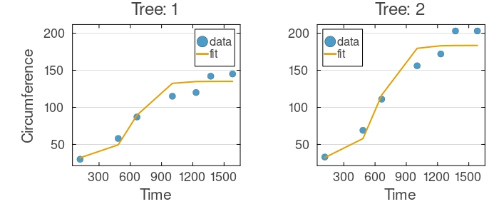
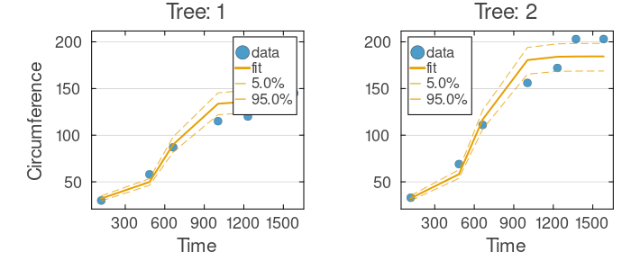
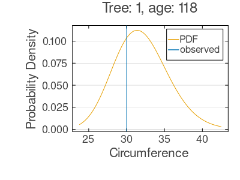
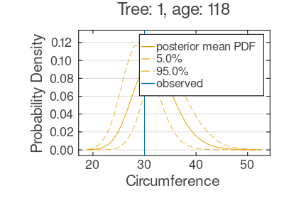
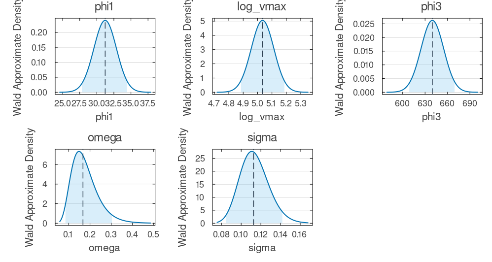
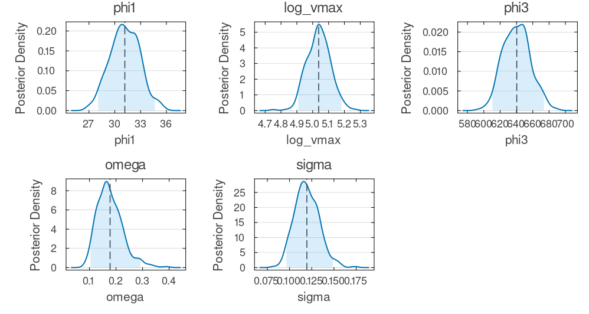

# Mixed-Effects Tutorial 1: Nonlinear Random-Effects Model Across Multiple Estimation Methods

Nonlinear mixed-effects (NLME) models describe how individual trajectories vary around a shared population trend. A practical question follows: how sensitive are the conclusions to the estimation algorithm? This tutorial fits one nonlinear growth model to the Orange tree dataset with four estimators — Laplace, MCEM, SAEM, and full Bayesian MCMC — and compares them on fitted trajectories, observation-level predictions, and parameter uncertainty, leaving you with a reusable template for multi-method comparison.

## What You Will Learn

- Build a nonlinear mixed-effects model with a lognormal random effect on a growth asymptote.
- Configure four estimators — Laplace, MCEM, SAEM, MCMC — with sensible defaults.
- Compare methods in predictive space, not just by objective values.
- See where the estimators agree, where they diverge, and what each adds.

## Step 1: Data Setup

The Orange tree dataset (Draper and Smith, 1981; R's `datasets`) records trunk circumference for five trees at seven time points over roughly four years. The between-tree variation in final size makes it a natural random-effects example.

```julia
using NoLimits
using CSV
using DataFrames
using Distributions
using Downloads
using Random
using SciMLBase
using Turing

include(joinpath(@__DIR__, "_data_loaders.jl"))

Random.seed!(42)

df = load_orange()

first(df, 8)
```

<!- injected:t1-dfhead ->
```text
8×4 DataFrame
 Row │ rownames  Tree   age    circumference
     │ Int64     Int64  Int64  Int64
─────┼───────────────────────────────────────
   1 │        1      1    118             30
   2 │        2      1    484             58
   3 │        3      1    664             87
   4 │        4      1   1004            115
   5 │        5      1   1231            120
   6 │        6      1   1372            142
   7 │        7      1   1582            145
   8 │        8      2    118             33
```

## Step 2: Define the Nonlinear Mixed-Effects Model

Each tree follows a saturating growth curve toward a tree-specific maximum. That maximum (the asymptote) is the random effect: every tree gets its own upper bound while sharing the population growth shape.

The curve uses an initial size `phi1`, a log-scale population asymptote `log_vmax`, and a midpoint `phi3`. Each tree's asymptote `vmax_i` is drawn from a `LogNormal`, keeping it positive and placing variability on a multiplicative scale; the observation model is also lognormal, so residual spread grows with the prediction, and `softplus` keeps the mean positive without hard discontinuities. All fixed effects get weakly-informative priors — optional for Laplace/MCEM/SAEM, required for MCMC.

```julia
model = @Model begin
    @helpers begin
        softplus(u) = u > 20 ? u : log1p(exp(u))
    end

    @covariates begin
        age = Covariate()
    end

    @fixedEffects begin
        phi1     = RealNumber(30.0,  prior=LogNormal(log(30.0), 0.30), calculate_se=true)
        log_vmax = RealNumber(5.0,   prior=Normal(5.00, 0.35),          calculate_se=true)
        phi3     = RealNumber(700.0, prior=LogNormal(log(700.0), 0.30), calculate_se=true)
        omega    = RealNumber(0.3, scale=:log, prior=LogNormal(log(0.155), 0.35), calculate_se=true)
        sigma    = RealNumber(0.3, scale=:log, prior=LogNormal(log(0.113), 0.30), calculate_se=true)
    end

    @randomEffects begin
        vmax_i = RandomEffect(LogNormal(log_vmax, omega); column=:Tree)
    end

    @formulas begin
        mu_raw = phi1 + (vmax_i - phi1) / (1 + exp(-(age - phi3) / 100))
        mu = softplus(mu_raw) + 1e-6
        circumference ~ LogNormal(log(mu), sigma)
    end
end
```

### Model Summary

Inspect the assembled model to confirm blocks, dimensions, scales, and priors:

```julia
model_summary = NoLimits.summarize(model)
model_summary
```

<!- injected:t1-model ->
```text
ModelSummary
════════════════════════════════════════════════════════════════════════════════════════════════
Overview
  model type                          : non-ODE
  fixed-effect blocks                 : 5
  fixed-effect scalar values          : 5
  random effects                      : 1
  random-effect grouping columns      : 1
  covariates (declared)               : 1
  formulas (deterministic / outcomes) : 2 / 1
  requires DE accessors               : false

Structure blocks
  helpers              : true
  fixed effects        : true
  random effects       : true
  covariates           : true
  preDE                : false
  DifferentialEquation : false
  initialDE            : false

Covariate classes
  varying  : 1
  constant : 0
  dynamic  : 0

Fixed-effects declarations
  name      type        size  se  prior      scale     bounds                              details
  -------------------------------------------------------------------------------------------------------------
  phi1      RealNumber     1  yes  LogNormal  identity  finite lower 0/1, finite upper 0/1  -
  log_vmax  RealNumber     1  yes  Normal     identity  finite lower 0/1, finite upper 0/1  -
  phi3      RealNumber     1  yes  LogNormal  identity  finite lower 0/1, finite upper 0/1  -
  omega     RealNumber     1  yes  LogNormal  log       finite lower 1/1, finite upper 0/1  -
  sigma     RealNumber     1  yes  LogNormal  log       finite lower 1/1, finite upper 0/1  -

Random-effects declarations
  name    group  dist     
  --------------------------
  vmax_i  Tree   LogNormal

Covariate declarations
  name  kind       columns                   constant_on           interpolation
  ---------------------------------------------------------------------------------------
  age   Covariate  age                       -                     -

Formulas
  deterministic names : mu_raw, mu
  outcome names       : circumference
  required DE states  : (none)
  required DE signals : (none)
  declared DE states  : (none)
  declared DE signals : (none)
Outcome distribution types
  circumference => LogNormal

Helper functions
  names : softplus
```

## Step 3: Build the DataModel and Configure Estimation Methods

The `DataModel` validates the schema, groups individuals into random-effect batches, and prepares the internal representations. The four methods take fundamentally different approaches to the random-effects integral in the marginal likelihood:

- **[Laplace](../estimation/laplace.md)** — analytic second-order approximation around each individual's empirical-Bayes mode; fast and deterministic.
- **[MCEM](../estimation/mcem.md)** — Monte Carlo EM: sample the random effects in the E-step, maximize in the M-step; robust to non-Gaussian random effects.
- **[SAEM](../estimation/saem.md)** — stochastic-approximation EM: updates running sufficient statistics, so it needs fewer samples per iteration.
- **[MCMC](../estimation/mcmc.md)** — samples the full joint posterior, the richest uncertainty picture at the highest cost.

The settings below favor short runtimes; production runs would raise iteration counts and sample sizes. SAEM uses pure defaults (`NoLimits.SAEM()`) on purpose — with sensible starts it reaches the same solution as the tuned estimators.

One detail matters for every estimator, especially the stochastic ones: `log_vmax` starts at `5.0` (`exp(5.0) ≈ 148`, a plausible asymptote). SAEM and the EM methods draw random effects from the *current* parameters, so a start far from the data (say `log_vmax = 10.0`, an asymptote near `22000`) can trap the sampler in a degenerate region. Starting values on the right order of magnitude are one of the most effective ways to make mixed-effects estimation robust.

```julia
dm = DataModel(model, df; primary_id=:Tree, time_col=:age)

laplace_method = NoLimits.Laplace(; multistart_n=0, multistart_k=0, optim_kwargs=(maxiters=120,))

mcem_method = NoLimits.MCEM(;
    maxiters=20,
    sample_schedule=i -> min(60 + 20 * (i - 1), 220),
    turing_kwargs=(n_samples=60, n_adapt=20, progress=false),
    optim_kwargs=(maxiters=200,),
    progress=false,
)

saem_method = NoLimits.SAEM()

mcmc_method = NoLimits.MCMC(;
    sampler=NUTS(0.75),
    progress=false,
    turing_kwargs=(n_samples=1000, n_adapt=500, progress=false),
)

serialization = SciMLBase.EnsembleThreads()
```

### DataModel Summary

Confirm that individuals, covariates, and random-effect groupings were detected correctly:

```julia
dm_summary = NoLimits.summarize(dm)
dm_summary
```

<!- injected:t1-dm ->
```text
DataModelSummary
════════════════════════════════════════════════════════════════════════════════════════════════
Overview
  model type                 : non-ODE
  event-aware                : false
  individuals                : 5
  rows (total / obs / event) : 35 / 35 / 0
  fixed effects (top-level)  : 5
  outcomes                   : 1
  covariates (declared)      : 1
  random effects             : 1

Covariate classes
  varying  : 1
  constant : 0
  dynamic  : 0

Outcome distribution types
  circumference => LogNormal

Random-effect distribution types
  vmax_i => LogNormal

Individual design diagnostics
  individuals with one observation              : 0
  global observed time range                    : 118.0 to 1582.0
  unique observed time points                   : 7
  duplicate (ID, time) observation rows         : 0
  monotonic-time violations (observation order) : 0

Observations per individual
  metric       n          mean            sd           min           q25        median           q75           max
  ----------------------------------------------------------------------------------------------------------------
  count        5           7.0           0.0           7.0           7.0           7.0           7.0           7.0

Time span per individual
  metric       n          mean            sd           min           q25        median           q75           max
  ----------------------------------------------------------------------------------------------------------------
  span         5        1464.0           0.0        1464.0        1464.0        1464.0        1464.0        1464.0

Median sampling interval per individual
  metric          n          mean            sd           min           q25        median           q75           max
  -------------------------------------------------------------------------------------------------------------------
  median_dt       5         218.5           0.0         218.5         218.5         218.5         218.5         218.5

Outcome descriptive statistics (observation rows)
  Variable            n          mean            sd           min           q25        median           q75           max
  -----------------------------------------------------------------------------------------------------------------------
  circumference      35      115.8571        56.661          30.0          65.5         115.0         161.5         214.0

Declared covariates
  name  kind       columns
  -------------------------------------
  age   Covariate  age

Covariate descriptive statistics (observation rows)
  Variable       n          mean            sd           min           q25        median           q75           max
  ------------------------------------------------------------------------------------------------------------------
  age.age       35      922.1429       484.787         118.0         484.0        1004.0        1372.0        1582.0

Per-random-effect summary
  random effect  group  dist         levels  rows/level min        median           max
  -----------------------------------------------------------------------------------
  vmax_i         Tree   LogNormal         5             7.0           7.0           7.0
```

## Step 4: Fit All Methods

Fit the same `DataModel` with all four estimators; each `fit_model` call returns a `FitResult` holding the parameters, convergence diagnostics, and a reference to the data model. Distinct seeds keep the stochastic methods reproducible.

```julia
res_laplace = fit_model(dm, laplace_method; serialization=serialization, rng=Random.Xoshiro(11))
res_mcem = fit_model(dm, mcem_method; serialization=serialization, rng=Random.Xoshiro(12))
res_saem = fit_model(dm, saem_method; serialization=serialization, rng=Random.Xoshiro(13))
res_mcmc = fit_model(dm, mcmc_method; serialization=serialization, rng=Random.Xoshiro(14))
```

### FitResult Summaries

Summarizing each result shows parameter values, convergence, and method-specific diagnostics — a quick first check that the methods broadly agree.

```julia
fit_summary_laplace = NoLimits.summarize(res_laplace)
fit_summary_mcem = NoLimits.summarize(res_mcem)
fit_summary_saem = NoLimits.summarize(res_saem)
fit_summary_mcmc = NoLimits.summarize(res_mcmc)

fit_summary_laplace
```

<!- injected:t1-fitlap ->
```text
FitResultSummary
════════════════════════════════════════════════════════════════════════════════════════════════
Overview
  method                              : laplace
  inference                           : frequentist
  scale                               : natural
  objective                           : 140.191
  iterations                          : 40
  parameters shown (reported / total) : 5 / 5

Parameter estimates
  parameter      Estimate
  -----------------------
  phi1            31.2235
  log_vmax         5.0347
  phi3           639.7141
  omega            0.1669
  sigma            0.1126

Outcome data coverage
  outcome             n_obs   n_missing
  -------------------------------------
  circumference          35           0
  TOTAL                  35           0

Empirical Bayes random effects summary (across RE levels)
  random effect       n          mean            sd           q25        median           q75
  ---------------------------------------------------------------------------
  vmax_i              5      155.3009       24.9109      134.1697      147.4651      182.2564
```

## Step 5: Compare Objective Values (Laplace, MCEM, SAEM)

It is tempting to compare objective function values across methods, but this requires care: each method optimizes a different quantity, so raw values are not directly comparable.

```julia
objectives = (
    laplace=NoLimits.get_objective(res_laplace),
    mcem=NoLimits.get_objective(res_mcem),
    saem=NoLimits.get_objective(res_saem),
)

objectives
```

<!- injected:t1-obj ->
```text
(laplace = 140.19104904494876, mcem = -157.26026347250098, saem = -154.8177352877204)
```

The values differ by construction:

- **Laplace** reports the minimized Laplace-approximated marginal likelihood (lower is better).
- **MCEM** and **SAEM** report the EM auxiliary quantity `Q`, a log-likelihood lower bound (higher is better).

So raw values are not comparable across method families, though within one family they are — e.g. across starting points or model variants.

## Step 6: Compare Parameter Estimates Side by Side

Parameter estimates *are* comparable across methods, and `compare_parameters` lines them up by name on a common scale (`:natural` by default); parameters absent from a model show as `-`. For Laplace/MCEM/SAEM the value is the point estimate at the optimum; for MCMC it is the posterior median (per component, post-warmup), which aligns directly with those point estimates.

```julia
param_comparison = compare_parameters(
    res_laplace, res_mcem, res_saem, res_mcmc;
    labels = ["Laplace", "MCEM", "SAEM", "MCMC"],
)

param_comparison
```

<!- injected:t1-paramcompare ->
```text
ParameterComparison
===================================================
  parameter   Laplace      MCEM      SAEM      MCMC
---------------------------------------------------
  phi1        31.2235    31.232   31.1846   31.2431
  log_vmax     5.0347    5.0352     5.035    5.0339
  phi3       639.7141   639.912  639.2453  639.8539
  omega        0.1669    0.1671    0.1615    0.1719
  sigma        0.1126    0.1125    0.1054     0.118
```

The agreement is striking: all four recover the same initial size (`phi1 ≈ 31`), log-asymptote (`log_vmax ≈ 5.04`, i.e. ~155), midpoint (`phi3 ≈ 640`), and variability (`omega ≈ 0.16`, `sigma ≈ 0.11`), with differences well within Monte Carlo noise. When estimates line up this cleanly, the conclusions are not an artifact of the algorithm.

As an alternative to the `labels` keyword, you can pass `label => fit` pairs directly:

```julia
compare_parameters(
    "Laplace" => res_laplace,
    "MCEM"    => res_mcem,
    "SAEM"    => res_saem,
    "MCMC"    => res_mcmc,
)
```

## Step 7: Fitted Trajectories for the First Two Individuals

The clearest comparison is in predictive space: do the fitted trajectories agree on the data? Below are the first two trees under each method; for MCMC we add posterior predictive bands (5th/95th percentiles), which fold in both parameter and random-effect uncertainty.

```julia
inds = collect(1:min(2, length(dm.individuals)))

p_fit_laplace = plot_fits(
    res_laplace;
    observable=:circumference,
    individuals_idx=inds,
    ncols=2,
    shared_x_axis=true,
    shared_y_axis=true,
)

p_fit_mcem = plot_fits(
    res_mcem;
    observable=:circumference,
    individuals_idx=inds,
    ncols=2,
    shared_x_axis=true,
    shared_y_axis=true,
)

p_fit_saem = plot_fits(
    res_saem;
    observable=:circumference,
    individuals_idx=inds,
    ncols=2,
    shared_x_axis=true,
    shared_y_axis=true,
)

p_fit_mcmc = plot_fits(
    res_mcmc;
    observable=:circumference,
    individuals_idx=inds,
    ncols=2,
    shared_x_axis=true,
    shared_y_axis=true,
    plot_mcmc_quantiles=true,
    mcmc_quantiles=[5, 95],
    mcmc_warmup=500,
    mcmc_draws=300,
    rng=Random.Xoshiro(201),
)

```

Well-calibrated, the four give broadly similar trajectories; differences show mainly in the data-sparse tails.

Laplace fit plot:

```julia
p_fit_laplace
```

<!- injected:t1-pfitlap ->


MCEM fit plot:

```julia
p_fit_mcem
```

<!- injected:t1-pfitmcem ->


SAEM fit plot:

```julia
p_fit_saem
```

<!- injected:t1-pfitsaem ->


With default settings and sensible starts, SAEM is visually indistinguishable from the others, tracking the saturating curve cleanly. This is the payoff of the starting-value discussion in Step 3: once the sampler begins in a sensible region, the out-of-the-box configuration recovers the population parameters (`phi3 ≈ 639`, `log_vmax ≈ 5.04`, `omega ≈ 0.16`) to within stochastic noise.

MCMC fit plot (with posterior predictive bands):

```julia
p_fit_mcmc
```

<!- injected:t1-pfitmcmc ->


## Step 8: Observation Distribution Diagnostics (First Individual)

Each method's observation-level distribution at the first observation of the first tree, with the observed value marked. A consistent tail position across methods would point to a misspecified observation model (here lognormal).

```julia
p_obs_laplace = plot_observation_distributions(
    res_laplace;
    observables=:circumference,
    individuals_idx=1,
    obs_rows=1,
)

p_obs_mcem = plot_observation_distributions(
    res_mcem;
    observables=:circumference,
    individuals_idx=1,
    obs_rows=1,
)

p_obs_saem = plot_observation_distributions(
    res_saem;
    observables=:circumference,
    individuals_idx=1,
    obs_rows=1,
)

p_obs_mcmc = plot_observation_distributions(
    res_mcmc;
    observables=:circumference,
    individuals_idx=1,
    obs_rows=1,
    mcmc_warmup=500,
    mcmc_draws=300,
    rng=Random.Xoshiro(202),
)

```

Laplace observation distribution:

```julia
p_obs_laplace
```

<!- injected:t1-pobslap ->


MCEM observation distribution:

```julia
p_obs_mcem
```

<!- injected:t1-pobsmcem ->


SAEM observation distribution:

```julia
p_obs_saem
```

<!- injected:t1-pobssaem ->


MCMC observation distribution:

```julia
p_obs_mcmc
```

<!- injected:t1-pobsmcmc ->


## Step 9: Uncertainty Quantification Across Methods

The optimization-based methods return point estimates, so uncertainty comes from Wald intervals built on the objective's curvature at the optimum — a sharp peak gives tight intervals, a flat one wide (see [Wald UQ](../uncertainty-quantification/wald.md)). MCMC instead gives exact posterior draws. Below we compute UQ for all four and plot the parameter distributions on the natural scale.

```julia
uq_laplace = compute_uq(
    res_laplace;
    method=:wald,
    vcov=:hessian,
    pseudo_inverse=true,
    serialization=serialization,
    n_draws=400,
    rng=Random.Xoshiro(101),
)
uq_mcem = compute_uq(
    res_mcem;
    method=:wald,
    vcov=:hessian,
    re_approx=:laplace,
    pseudo_inverse=true,
    serialization=serialization,
    n_draws=400,
    rng=Random.Xoshiro(102),
)
uq_saem = compute_uq(
    res_saem;
    method=:wald,
    vcov=:hessian,
    re_approx=:laplace,
    pseudo_inverse=true,
    serialization=serialization,
    n_draws=400,
    rng=Random.Xoshiro(103),
)
uq_mcmc = compute_uq(
    res_mcmc;
    method=:chain,
    serialization=serialization,
    mcmc_warmup=500,
    mcmc_draws=300,
    rng=Random.Xoshiro(104),
)
p_uq_laplace = plot_uq_distributions(uq_laplace; scale=:natural, plot_type=:density, show_legend=false)
p_uq_mcem = plot_uq_distributions(uq_mcem; scale=:natural, plot_type=:density, show_legend=false)
p_uq_saem = plot_uq_distributions(uq_saem; scale=:natural, plot_type=:density, show_legend=false)
p_uq_mcmc = plot_uq_distributions(uq_mcmc; scale=:natural, plot_type=:density, show_legend=false)

```

### UQ Summaries

These report point estimates with intervals per parameter. Agreement signals robust inference; divergence flags sensitivity to the estimator, an under-identified parameter, or insufficient data.

```julia
uq_summary_laplace = NoLimits.summarize(uq_laplace)
uq_summary_mcem = NoLimits.summarize(uq_mcem)
uq_summary_saem = NoLimits.summarize(uq_saem)
uq_summary_mcmc = NoLimits.summarize(uq_mcmc)

fit_uq_summary_laplace = NoLimits.summarize(res_laplace, uq_laplace)
fit_uq_summary_mcem = NoLimits.summarize(res_mcem, uq_mcem)
fit_uq_summary_saem = NoLimits.summarize(res_saem, uq_saem)
fit_uq_summary_mcmc = NoLimits.summarize(res_mcmc, uq_mcmc)

fit_uq_summary_laplace
```

<!- injected:t1-fituqlap ->
```text
UQResultSummary
════════════════════════════════════════════════════════════════════════════════════════════════
Overview
  backend                             : wald
  source_method                       : laplace
  inference                           : frequentist
  scale                               : natural
  objective                           : 140.191
  interval level                      : 0.95
  parameters shown (reported / total) : 5 / 5

Parameter uncertainty summary
  parameter      Estimate    Std. Error      CI Lower      CI Upper
  ---------------------------------------------------
  phi1            31.2235        1.6549       27.8177       34.4233
  log_vmax         5.0347        0.0794        4.8845        5.1866
  phi3           639.7141       15.7902      608.8016      669.4465
  omega            0.1669        0.0588        0.0841        0.3032
  sigma            0.1126        0.0149        0.0847        0.1418

Outcome data coverage
  outcome             n_obs   n_missing
  -------------------------------------
  circumference          35           0
  TOTAL                  35           0

Empirical Bayes random effects summary (across RE levels)
  random effect       n          mean            sd           q25        median           q75
  ---------------------------------------------------------------------------
  vmax_i              5      155.3009       24.9109      134.1697      147.4651      182.2564
```

Laplace UQ distribution:

```julia
p_uq_laplace
```

<!- injected:t1-puqlap ->


MCEM UQ distribution:

```julia
p_uq_mcem
```

<!- injected:t1-puqmcem ->


SAEM UQ distribution:

```julia
p_uq_saem
```

<!- injected:t1-puqsaem ->


MCMC UQ distribution:

```julia
p_uq_mcmc
```

<!- injected:t1-puqmcmc ->


## Interpretation and Practical Guidance

- **Compare in predictive space, not objective space.** Each method optimizes a different quantity, so compare trajectories, observation distributions, and intervals — not raw objective values.
- **Agreement is the norm for well-specified models.** When Laplace, MCEM, and SAEM diverge, suspect misspecification, too few iterations, or a hard likelihood surface.
- **MCMC gives the richest uncertainty.** Posterior bands and marginals capture asymmetry, multimodality, and correlation most faithfully.
- **Pick by inferential goal.** Fast point estimates with approximate SEs → Laplace; flexible random-effect distributions → SAEM/MCEM; full posterior inference → MCMC.
