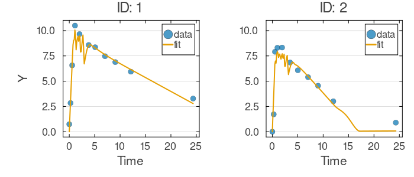
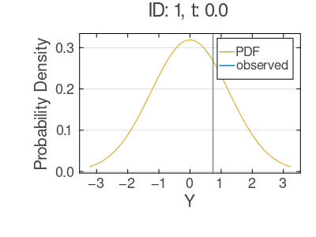

# Mixed-Effects Tutorial 3: Neural Differential-Equation Components (SAEM)

Often we know a dynamical system's structure — compartments and transfer pathways — but not the exact rate laws. Neural ODEs close that gap by embedding small neural networks inside the ODE right-hand side, letting the data shape the unknown functional forms while the compartmental structure stays interpretable. This tutorial builds a two-compartment Neural ODE for the Theophylline data and fits it with Stochastic Approximation Expectation-Maximization (SAEM), with subject-level random effects on the network weights so each individual gets a personalized version of the dynamics.

## Learning Goals

- Declare `NNParameters` blocks and wire them into `@DifferentialEquation`.
- Couple network weights to subject-level random effects via `MvNormal`.
- Fit with default SAEM, stable even at high random-effect dimension.
- Diagnose the fitted trajectories and observation distributions.

## Step 1: Data Setup

We use the Theophylline dataset (12 subjects, concentration over time) in a flat format where the dose `d` enters as a constant covariate — a two-compartment transfer system (depot → central → cleared).

```julia
using NoLimits
using CSV
using DataFrames
using Distributions
using Downloads
using Random
using LinearAlgebra
using OrdinaryDiffEq
using SciMLBase
using SimpleChains
using Turing

include(joinpath(@__DIR__, "_data_loaders.jl"))

Random.seed!(321)

theoph_df = load_theoph()

function build_theoph_non_event_df(tbl::DataFrame)
    df = DataFrame(
        ID=Int.(tbl.Subject),
        t=Float64.(tbl.Time),
        y=Float64.(tbl.conc),
        d=Float64.(tbl.Wt .* tbl.Dose),
    )
    sort!(df, [:ID, :t])
    return df
end

df = build_theoph_non_event_df(theoph_df)
first(df, 10)
```

<!- injected:t3-dfhead ->
```text
10×4 DataFrame
 Row │ ID     t        y        d
     │ Int64  Float64  Float64  Float64
─────┼──────────────────────────────────
   1 │     1     0.0      0.74  319.992
   2 │     1     0.25     2.84  319.992
   3 │     1     0.57     6.57  319.992
   4 │     1     1.12    10.5   319.992
   5 │     1     2.02     9.66  319.992
   6 │     1     3.82     8.58  319.992
   7 │     1     5.1      8.36  319.992
   8 │     1     7.03     7.47  319.992
   9 │     1     9.05     6.89  319.992
  10 │     1    12.12     5.94  319.992
```

## Step 2: Define the Neural ODE Mixed-Effects Model

Instead of closed-form rate laws, neural networks learn the rate functions from data. Each `NNParameters` block declares a small feedforward network whose flattened weights join the fixed-effects vector and expose a callable (e.g. `NNA1`) usable inside `@DifferentialEquation` (see [function approximators](../model-building/universal-function-approximators.md)). Four networks drive the two-compartment system: `fA1`/`fA2` for the depot, `fC1`/`fC2` for the central compartment.

Each network's weights are paired with a subject-level random-effect vector (`etaA1`, `etaA2`, `etaC1`, `etaC2`) drawn from an `MvNormal` centered on the population weights, so every individual gets a personalized network around shared population structure.

```julia
using NoLimits
using Distributions
using LinearAlgebra
using OrdinaryDiffEq
using SimpleChains

width_nn = 2
chain_A1 = SimpleChain(static(1), TurboDense(tanh, width_nn), TurboDense(identity, 1))
chain_A2 = SimpleChain(static(1), TurboDense(tanh, width_nn), TurboDense(identity, 1))
chain_C1 = SimpleChain(static(1), TurboDense(tanh, width_nn), TurboDense(identity, 1))
chain_C2 = SimpleChain(static(1), TurboDense(tanh, width_nn), TurboDense(identity, 1))

model_raw = @Model begin
    @helpers begin
        softplus(u) = u > 20 ? u : log1p(exp(u))
    end

    @covariates begin
        t = Covariate()
        d = ConstantCovariate(constant_on=:ID)
    end

    @fixedEffects begin
        sigma = RealNumber(1.0, scale=:log, prior=LogNormal(log(1.0), 0.5), calculate_se=true)

        zA1 = NNParameters(chain_A1; function_name=:NNA1, calculate_se=false)
        zA2 = NNParameters(chain_A2; function_name=:NNA2, calculate_se=false)
        zC1 = NNParameters(chain_C1; function_name=:NNC1, calculate_se=false)
        zC2 = NNParameters(chain_C2; function_name=:NNC2, calculate_se=false)
    end

    @randomEffects begin
        etaA1 = RandomEffect(MvNormal(zA1, Diagonal(ones(length(zA1)))); column=:ID)
        etaA2 = RandomEffect(MvNormal(zA2, Diagonal(ones(length(zA2)))); column=:ID)
        etaC1 = RandomEffect(MvNormal(zC1, Diagonal(ones(length(zC1)))); column=:ID)
        etaC2 = RandomEffect(MvNormal(zC2, Diagonal(ones(length(zC2)))); column=:ID)
    end

    @DifferentialEquation begin
        a_A(t) = softplus(depot)
        x_C(t) = softplus(center)

        fA1(t) = softplus(NNA1([t / 24], etaA1)[1])
        fA2(t) = softplus(NNA2([a_A(t)], etaA2)[1])
        fC1(t) = -softplus(NNC1([x_C(t)], etaC1)[1])
        fC2(t) = softplus(NNC2([t / 24], etaC2)[1])

        D(depot) ~ -d * fA1(t) - fA2(t)
        D(center) ~ d * fA1(t) + fA2(t) + fC1(t) + d * fC2(t)
    end

    @initialDE begin
        depot = d
        center = 0.0
    end

    @formulas begin
        y ~ Normal(center(t), sigma)
    end
end

model = set_solver_config(
    model_raw;
    saveat_mode=:saveat,
    alg=AutoTsit5(Rosenbrock23()),
    kwargs=(abstol=1e-2, reltol=1e-2),
)
```

### Model Summary

`summarize` confirms the blocks assembled correctly:

```julia
model_summary = NoLimits.summarize(model)
model_summary
```

<!- injected:t3-model ->
```text
ModelSummary
════════════════════════════════════════════════════════════════════════════════════════════════
Overview
  model type                          : ODE
  fixed-effect blocks                 : 5
  fixed-effect scalar values          : 29
  random effects                      : 4
  random-effect grouping columns      : 1
  covariates (declared)               : 2
  formulas (deterministic / outcomes) : 0 / 1
  requires DE accessors               : true

Structure blocks
  helpers              : true
  fixed effects        : true
  random effects       : true
  covariates           : true
  preDE                : false
  DifferentialEquation : true
  initialDE            : true

Covariate classes
  varying  : 1
  constant : 1
  dynamic  : 0

Fixed-effects declarations
  name   type          size  se  prior      scale  bounds                              details
  ---------------------------------------------------------------------------------------------------------
  sigma  RealNumber       1  yes  LogNormal  log    finite lower 1/1, finite upper 0/1  -
  zA1    NNParameters     7  no  Priorless  n/a    finite lower 0/7, finite upper 0/7  function=NNA1, weights=7
  zA2    NNParameters     7  no  Priorless  n/a    finite lower 0/7, finite upper 0/7  function=NNA2, weights=7
  zC1    NNParameters     7  no  Priorless  n/a    finite lower 0/7, finite upper 0/7  function=NNC1, weights=7
  zC2    NNParameters     7  no  Priorless  n/a    finite lower 0/7, finite upper 0/7  function=NNC2, weights=7

Random-effects declarations
  name   group  dist    
  ------------------------
  etaA1  ID     MvNormal
  etaA2  ID     MvNormal
  etaC1  ID     MvNormal
  etaC2  ID     MvNormal

Covariate declarations
  name  kind               columns                   constant_on           interpolation
  -----------------------------------------------------------------------------------------------
  t     Covariate          t                         -                     -
  d     ConstantCovariate  d                         ID                    -

Formulas
  deterministic names : (none)
  outcome names       : y
  required DE states  : center
  required DE signals : (none)
  declared DE states  : depot, center
  declared DE signals : a_A, x_C, fA1, fA2, fC1, fC2
Outcome distribution types
  y => Normal

Helper functions
  names : softplus
```

## Step 3: Build the `DataModel` and Configure SAEM

After building the `DataModel`, we fit with default SAEM (`NoLimits.SAEM()`): an adaptive-Metropolis E-step samples the random effects, a stochastic-approximation (Robbins-Monro) M-step updates the population parameters (see [SAEM](../estimation/saem.md)). No tuning is needed despite the high random-effect dimension — four network-weight vectors per subject.

```julia
dm = DataModel(model, df; primary_id=:ID, time_col=:t)

saem_method = NoLimits.SAEM()

serialization = SciMLBase.EnsembleThreads()
```

### DataModel Summary

Confirm individuals, covariates, and grouping structures:

```julia
dm_summary = NoLimits.summarize(dm)
dm_summary
```

<!- injected:t3-dm ->
```text
DataModelSummary
════════════════════════════════════════════════════════════════════════════════════════════════
Overview
  model type                 : ODE
  event-aware                : false
  individuals                : 12
  rows (total / obs / event) : 132 / 132 / 0
  fixed effects (top-level)  : 5
  outcomes                   : 1
  covariates (declared)      : 2
  random effects             : 4

Covariate classes
  varying  : 1
  constant : 1
  dynamic  : 0

Outcome distribution types
  y => Normal

Random-effect distribution types
  etaA1 => MvNormal
  etaA2 => MvNormal
  etaC1 => MvNormal
  etaC2 => MvNormal

Individual design diagnostics
  individuals with one observation              : 0
  global observed time range                    : 0.0 to 24.65
  unique observed time points                   : 78
  duplicate (ID, time) observation rows         : 0
  monotonic-time violations (observation order) : 0

Observations per individual
  metric       n          mean            sd           min           q25        median           q75           max
  ----------------------------------------------------------------------------------------------------------------
  count       12          11.0           0.0          11.0          11.0          11.0          11.0          11.0

Time span per individual
  metric       n          mean            sd           min           q25        median           q75           max
  ----------------------------------------------------------------------------------------------------------------
  span        12       24.1992        0.2439          23.7         24.11        24.195        24.355         24.65

Median sampling interval per individual
  metric          n          mean            sd           min           q25        median           q75           max
  -------------------------------------------------------------------------------------------------------------------
  median_dt      12        1.5092        0.0277         1.445        1.4975        1.5075        1.5312          1.55

Outcome descriptive statistics (observation rows)
  Variable       n          mean            sd           min           q25        median           q75           max
  ------------------------------------------------------------------------------------------------------------------
  y            132        4.9605        2.8564           0.0        2.8775         5.275          7.14          11.4

Declared covariates
  name  kind               columns
  ---------------------------------------------
  t     Covariate          t
  d     ConstantCovariate  d

Covariate descriptive statistics (observation rows)
  Variable       n          mean            sd           min           q25        median           q75           max
  ------------------------------------------------------------------------------------------------------------------
  t.t          132        5.8946        6.8997           0.0         0.595          3.53           9.0         24.65
  d.d          132      315.4398       14.3601        267.84       319.365        319.84       319.994        320.65

Per-random-effect summary
  random effect  group  dist        levels  rows/level min        median           max
  ----------------------------------------------------------------------------------
  etaA1          ID     MvNormal        12            11.0          11.0          11.0
  etaA2          ID     MvNormal        12            11.0          11.0          11.0
  etaC1          ID     MvNormal        12            11.0          11.0          11.0
  etaC2          ID     MvNormal        12            11.0          11.0          11.0
```

## Step 4: Fit the Model and Inspect Results

With defaults, SAEM runs up to 300 iterations. We extract the final objective and parameter count as a sanity check.

```julia
res_saem = fit_model(
    dm,
    saem_method;
    serialization=serialization,
    rng=Random.Xoshiro(21),
)

(
    objective=NoLimits.get_objective(res_saem),
    n_params=length(NoLimits.get_params(res_saem; scale=:untransformed)),
)
```

<!- injected:t3-obj ->
```text
(objective = -565.6734432525224, n_params = 29)
```

`summarize` gives parameter estimates and convergence diagnostics:

```julia
fit_summary_saem = NoLimits.summarize(res_saem)
fit_summary_saem
```

<!- injected:t3-fit ->
```text
FitResultSummary
════════════════════════════════════════════════════════════════════════════════════════════════
Overview
  method                              : saem
  inference                           : frequentist
  scale                               : natural
  objective                           : -565.6734
  iterations                          : 300
  parameters shown (reported / total) : 1 / 29

Parameter estimates
  parameter      Estimate
  -----------------------
  sigma            1.2516

Outcome data coverage
  outcome       n_obs   n_missing
  -------------------------------
  y               132           0
  TOTAL           132           0

Empirical Bayes random effects summary (across RE levels)
  random effect  component       n          mean            sd           q25        median           q75
  --------------------------------------------------------------------------------------------------
  etaA1          etaA1_1        12       -3.2608         0.007       -3.2633       -3.2619        -3.259
  etaA1          etaA1_2        12       -7.4295        0.0533       -7.4406       -7.4075       -7.4048
  etaA1          etaA1_3        12       -0.3189        0.1671       -0.4456       -0.3247       -0.2511
  etaA1          etaA1_4        12        1.7397        0.1548        1.6893        1.7748        1.8298
  etaA1          etaA1_5        12        1.0381        0.0855        0.9877         1.037        1.0692
  etaA1          etaA1_6        12        4.1726        0.2456        3.9889        4.1181        4.2466
  etaA1          etaA1_7        12       -7.1985        0.2266       -7.3706       -7.2566        -7.106
  etaA2          etaA2_1        12       -1.6694         0.025       -1.6635       -1.6615       -1.6615
  etaA2          etaA2_2        12         2.149        0.0055        2.1491        2.1491        2.1492
  etaA2          etaA2_3        12        1.5924         0.008        1.5908        1.5908        1.5916
  etaA2          etaA2_4        12        2.2571          0.01         2.258         2.258        2.2618
  etaA2          etaA2_5        12        2.7403         0.027        2.7463        2.7464        2.7469
  etaA2          etaA2_6        12       -3.4498        0.0113       -3.4529       -3.4518       -3.4517
  etaA2          etaA2_7        12        -2.902        0.0092       -2.9052       -2.9052       -2.9051
  etaC1          etaC1_1        12        1.3359        0.2004         1.158        1.3366        1.4721
  etaC1          etaC1_2        12        4.1416        0.0723        4.1114        4.1179        4.1545
  etaC1          etaC1_3        12      -10.7082        0.0431      -10.7333      -10.7161       -10.689
  etaC1          etaC1_4        12       -6.4091        0.0378       -6.4234       -6.4197       -6.4073
  etaC1          etaC1_5        12        9.8789          0.12         9.826        9.8426        9.9084
  etaC1          etaC1_6        12        4.3265        0.1072        4.2866        4.3572        4.3921
  etaC1          etaC1_7        12        4.9443         0.118        4.9058        4.9601        5.0143
  etaC2          etaC2_1        12       -2.5971        0.0053       -2.5966       -2.5954       -2.5954
  etaC2          etaC2_2        12        7.5833        0.0395        7.5659        7.5693         7.581
  etaC2          etaC2_3        12       -3.0693        0.0068        -3.072       -3.0707       -3.0684
  etaC2          etaC2_4        12       -1.5788        0.1091       -1.6396       -1.6206       -1.5935
  etaC2          etaC2_5        12        4.6203        0.0656        4.5629        4.6077        4.6731
  etaC2          etaC2_6        12       -3.8042        0.0522       -3.8469       -3.8027       -3.7733
  etaC2          etaC2_7        12       -3.7944        0.0685        -3.848       -3.7863       -3.7352
```

## Step 5: Visualize Fitted Trajectories

Overlaying predictions on the data for the first two subjects shows the neural ODE tracking the two-compartment rise-and-decay, with subject variation from the random effects.

```julia
p_fit_saem = plot_fits(
    res_saem;
    observable=:y,
    individuals_idx=[1, 2],
    ncols=2,
    shared_x_axis=true,
    shared_y_axis=true,
)

p_fit_saem
```

<!- injected:t3-pfit ->


## Step 6: Inspect the Observation Distribution

The predicted observation distribution at one data point for the first individual shows whether the residual variance is well-calibrated.

```julia
p_obs_saem = plot_observation_distributions(
    res_saem;
    observables=:y,
    individuals_idx=1,
    obs_rows=1,
)

p_obs_saem
```

<!- injected:t3-pobs ->


## Interpretation Notes

- **Hybrid mechanistic-neural ODE.** The compartments encode known structure (mass conservation, transfer); the networks fill in the unknown rate functions. This applies wherever the topology is known but the governing laws are not.
- **Default SAEM suffices** even at high random-effect dimension. For finer control, SAEM also exposes closed-form Gaussian block updates via `builtin_stats=:closed_form` with the `re_mean_params` mapping.
- **Settings are modest for speed.** For production, widen the networks, raise `maxiters` and sample counts, and tighten the ODE solver tolerances.
