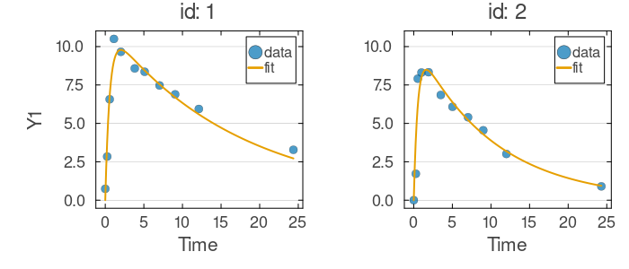
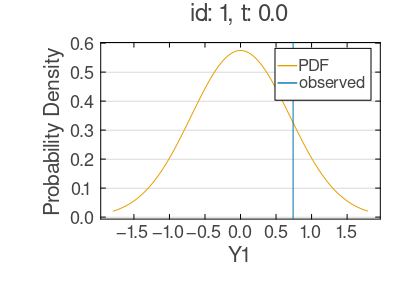
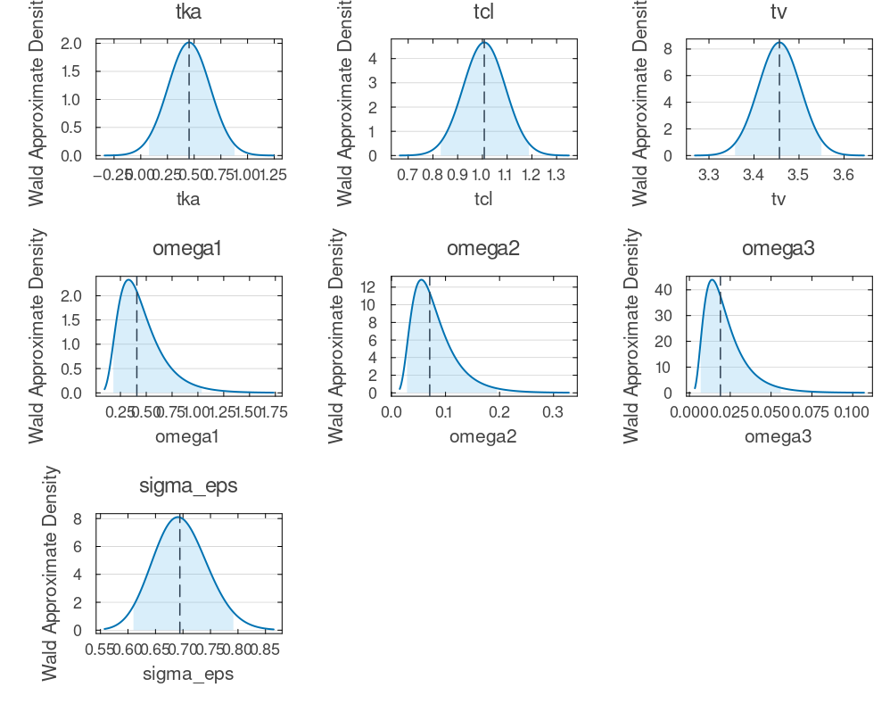

# Mixed-Effects Tutorial 2: ODE Model with Input Events (MCEM)

Many longitudinal systems follow ODE dynamics driven by discrete input events — a bolus injection, a nutrient pulse, a stimulus onset. This tutorial builds a two-compartment ODE model (`depot` → `center` → elimination) for the Theophylline concentration-time data, with subject-level random effects on the transfer rate `ka`, elimination rate `cl`, and volume `v`, and fits it with Monte Carlo Expectation-Maximization (MCEM) — well suited to models where random effects enter nonlinearly. The same workflow applies to any compartmental system with discrete inputs, from tracer kinetics to bioprocess engineering.

## What You Will Learn

- Prepare an event table for an ODE model with discrete inputs (`EVID`/`AMT`/`CMT`/`RATE`).
- Define a nonlinear mixed-effects ODE with `@preDifferentialEquation` and `@DifferentialEquation`.
- Fit it with MCEM and read the core diagnostics.
- Visualize fits, observation distributions, and Wald uncertainty.

## Step 1: Prepare the Event-Table

ODE models with discrete inputs use an *event table* that interleaves input events with observations, so the solver knows when and where to apply perturbations (see [Data Model Construction](../data-model-construction.md)). The key columns:

- `EVID` - input events (`1`) vs observation rows (`0`).
- `AMT` - magnitude of the input.
- `CMT` - the compartment that receives it.
- `RATE` - infusion rate; `0.0` is an instantaneous bolus.

We load Theophylline (twelve subjects) and reshape it so each subject receives one bolus into `depot` at time zero, followed by concentration observations.

```julia
using NoLimits
using CSV
using DataFrames
using Distributions
using Downloads
using Random
using LinearAlgebra
using OrdinaryDiffEq
using SciMLBase

include(joinpath(@__DIR__, "_data_loaders.jl"))

Random.seed!(123)

theoph_df = load_theoph()

function build_theoph_event_df(tbl::DataFrame)
    df = DataFrame(
        id=Int[],
        t=Float64[],
        AMT=Float64[],
        EVID=Int[],
        CMT=Union{String, Missing}[],
        RATE=Float64[],
        y1=Union{Float64, Missing}[],
        _event_order=Int[],
    )

    for g in groupby(tbl, :Subject)
        id = Int(first(g.Subject))
        amt = Float64(first(g.Wt)) * Float64(first(g.Dose))

        push!(df, (id, 0.0, amt, 1, "depot", 0.0, missing, 0))

        g_sorted = sort(DataFrame(g), :Time)
        for row in eachrow(g_sorted)
            push!(df, (id, Float64(row.Time), 0.0, 0, missing, 0.0, Float64(row.conc), 1))
        end
    end

    sort!(df, [:id, :t, :_event_order])
    select!(df, Not(:_event_order))
    return df
end

df = build_theoph_event_df(theoph_df)
first(df, 12)
```

<!- injected:t2-dfhead ->
```text
12×7 DataFrame
 Row │ id     t        AMT      EVID   CMT      RATE     y1
     │ Int64  Float64  Float64  Int64  String?  Float64  Float64?
─────┼──────────────────────────────────────────────────────────────
   1 │     1     0.0   319.992      1  depot        0.0  missing
   2 │     1     0.0     0.0        0  missing      0.0        0.74
   3 │     1     0.25    0.0        0  missing      0.0        2.84
   4 │     1     0.57    0.0        0  missing      0.0        6.57
   5 │     1     1.12    0.0        0  missing      0.0       10.5
   6 │     1     2.02    0.0        0  missing      0.0        9.66
   7 │     1     3.82    0.0        0  missing      0.0        8.58
   8 │     1     5.1     0.0        0  missing      0.0        8.36
   9 │     1     7.03    0.0        0  missing      0.0        7.47
  10 │     1     9.05    0.0        0  missing      0.0        6.89
  11 │     1    12.12    0.0        0  missing      0.0        5.94
  12 │     1    24.37    0.0        0  missing      0.0        3.28
```

## Step 2: Define the ODE Mixed-Effects Model

Each subject has three positive parameters — transfer rate `ka`, elimination rate `cl`, volume `v` — written as exponentials of a population fixed effect plus a subject deviation:

- `ka = exp(tka + eta[1])`
- `cl = exp(tcl + eta[2])`
- `v = exp(tv + eta[3])`

The deviations `eta` follow a multivariate normal with diagonal covariance (`omega1`, `omega2`, `omega3`), and observations are Normal around the central-compartment concentration with residual SD `sigma_eps`. Because `eta` enters through the exponential, the model is nonlinear in the random effects — the setting MCEM handles well. `set_solver_config` then selects `Tsit5()` (a non-stiff explicit Runge-Kutta) with the tolerances below.

```julia
using NoLimits
using Distributions
using LinearAlgebra
using OrdinaryDiffEq

model_raw = @Model begin
    @covariates begin
        t = Covariate()
    end

    @fixedEffects begin
        tka = RealNumber(0.45, prior=Uniform(0.1, 5.0), calculate_se=true)
        tcl = RealNumber(1.0, prior=Uniform(0.1, 5.0), calculate_se=true)
        tv = RealNumber(3.45, prior=Uniform(0.1, 5.0), calculate_se=true)

        omega1 = RealNumber(1.0, scale=:log, prior=Uniform(0.0, 2.0), calculate_se=true)
        omega2 = RealNumber(1.0, scale=:log, prior=Uniform(0.0, 2.0), calculate_se=true)
        omega3 = RealNumber(1.0, scale=:log, prior=Uniform(0.0, 2.0), calculate_se=true)

        sigma_eps = RealNumber(1.0, scale=:log, prior=Uniform(0.0, 2.0), calculate_se=true)
    end

    @randomEffects begin
        eta = RandomEffect(
            MvNormal([0.0, 0.0, 0.0], Diagonal([omega1, omega2, omega3]));
            column=:id,
        )
    end

    @preDifferentialEquation begin
        ka = exp(tka + eta[1])
        cl = exp(tcl + eta[2])
        v = exp(tv + eta[3])
    end

    @DifferentialEquation begin
        D(depot) ~ -ka * depot
        D(center) ~ ka * depot - cl / v * center
    end

    @initialDE begin
        depot = 0.0
        center = 0.0
    end

    @formulas begin
        y1 ~ Normal(center(t) / v, sigma_eps)
    end
end

model = set_solver_config(
    model_raw;
    saveat_mode=:saveat,
    alg=Tsit5(),
    kwargs=(abstol=1e-6, reltol=1e-6),
)
```

### Model Summary

`summarize` confirms the parsed blocks — fixed effects, random effects, covariates, ODE states, and formulas:

```julia
model_summary = NoLimits.summarize(model)
model_summary
```

<!- injected:t2-model ->
```text
ModelSummary
════════════════════════════════════════════════════════════════════════════════════════════════
Overview
  model type                          : ODE
  fixed-effect blocks                 : 7
  fixed-effect scalar values          : 7
  random effects                      : 1
  random-effect grouping columns      : 1
  covariates (declared)               : 1
  formulas (deterministic / outcomes) : 0 / 1
  requires DE accessors               : true

Structure blocks
  helpers              : false
  fixed effects        : true
  random effects       : true
  covariates           : true
  preDE                : true
  DifferentialEquation : true
  initialDE            : true

Covariate classes
  varying  : 1
  constant : 0
  dynamic  : 0

Fixed-effects declarations
  name       type        size  se  prior    scale     bounds                              details
  ------------------------------------------------------------------------------------------------------------
  tka        RealNumber     1  yes  Uniform  identity  finite lower 0/1, finite upper 0/1  -
  tcl        RealNumber     1  yes  Uniform  identity  finite lower 0/1, finite upper 0/1  -
  tv         RealNumber     1  yes  Uniform  identity  finite lower 0/1, finite upper 0/1  -
  omega1     RealNumber     1  yes  Uniform  log       finite lower 1/1, finite upper 0/1  -
  omega2     RealNumber     1  yes  Uniform  log       finite lower 1/1, finite upper 0/1  -
  omega3     RealNumber     1  yes  Uniform  log       finite lower 1/1, finite upper 0/1  -
  sigma_eps  RealNumber     1  yes  Uniform  log       finite lower 1/1, finite upper 0/1  -

Random-effects declarations
  name  group  dist    
  -----------------------
  eta   id     MvNormal

Covariate declarations
  name  kind       columns                   constant_on           interpolation
  ---------------------------------------------------------------------------------------
  t     Covariate  t                         -                     -

Formulas
  deterministic names : (none)
  outcome names       : y1
  required DE states  : center
  required DE signals : (none)
  declared DE states  : depot, center
  declared DE signals : (none)
Outcome distribution types
  y1 => Normal

Helper functions
  names : (none)
```

## Step 3: Build the DataModel

Constructing the `DataModel` validates the data and, for event-aware models, requires the event column names so the solver can tell input events from observations.

```julia
dm = DataModel(
    model,
    df;
    primary_id=:id,
    time_col=:t,
    evid_col=:EVID,
    amt_col=:AMT,
    rate_col=:RATE,
    cmt_col=:CMT,
)

```

### DataModel Summary

The summary reports individuals, observation counts, and event structure — a useful checkpoint before an expensive fit:

```julia
dm_summary = NoLimits.summarize(dm)
dm_summary
```

<!- injected:t2-dm ->
```text
DataModelSummary
════════════════════════════════════════════════════════════════════════════════════════════════
Overview
  model type                 : ODE
  event-aware                : true
  individuals                : 12
  rows (total / obs / event) : 144 / 132 / 12
  fixed effects (top-level)  : 7
  outcomes                   : 1
  covariates (declared)      : 1
  random effects             : 1

Covariate classes
  varying  : 1
  constant : 0
  dynamic  : 0

Outcome distribution types
  y1 => Normal

Random-effect distribution types
  eta => MvNormal

Individual design diagnostics
  individuals with one observation              : 0
  global observed time range                    : 0.0 to 24.65
  unique observed time points                   : 78
  duplicate (ID, time) observation rows         : 0
  monotonic-time violations (observation order) : 0

Observations per individual
  metric       n          mean            sd           min           q25        median           q75           max
  ----------------------------------------------------------------------------------------------------------------
  count       12          11.0           0.0          11.0          11.0          11.0          11.0          11.0

Time span per individual
  metric       n          mean            sd           min           q25        median           q75           max
  ----------------------------------------------------------------------------------------------------------------
  span        12       24.1992        0.2439          23.7         24.11        24.195        24.355         24.65

Median sampling interval per individual
  metric          n          mean            sd           min           q25        median           q75           max
  -------------------------------------------------------------------------------------------------------------------
  median_dt      12        1.5092        0.0277         1.445        1.4975        1.5075        1.5312          1.55

Outcome descriptive statistics (observation rows)
  Variable       n          mean            sd           min           q25        median           q75           max
  ------------------------------------------------------------------------------------------------------------------
  y1           132        4.9605        2.8564           0.0        2.8775         5.275          7.14          11.4

Declared covariates
  name  kind       columns
  -------------------------------------
  t     Covariate  t

Covariate descriptive statistics (observation rows)
  Variable       n          mean            sd           min           q25        median           q75           max
  ------------------------------------------------------------------------------------------------------------------
  t.t          132        5.8946        6.8997           0.0         0.595          3.53           9.0         24.65

Per-random-effect summary
  random effect  group  dist        levels  rows/level min        median           max
  ----------------------------------------------------------------------------------
  eta            id     MvNormal        12            11.0          11.0          11.0
```

## Step 4: Configure MCEM

MCEM alternates an E-step (sample random effects from their conditional posterior) with an M-step (maximize the expected complete-data log-likelihood); growing the E-step sample count across iterations sharpens the approximation as it converges (see [MCEM](../estimation/mcem.md)). The settings below keep runtime short — production runs would raise `maxiters`, the `sample_schedule` ceiling, and the per-E-step sample count. Here `sample_schedule` grows from 60 by 20 per iteration up to 260, and `EnsembleThreads()` solves the ODE across individuals in parallel.

```julia
mcem_method = NoLimits.MCEM(;
    maxiters=12,
    sample_schedule=i -> min(60 + 20 * (i - 1), 260),
    turing_kwargs=(n_samples=60, n_adapt=20, progress=false),
    optim_kwargs=(maxiters=220,),
    progress=false,
)

serialization = SciMLBase.EnsembleThreads()
```

## Step 5: Fit the Model and Inspect Core Outputs

Running the fit performs the full MCEM loop. The final objective is the marginal log-likelihood approximation at convergence — useful for monitoring, but model adequacy is best judged by the predictive diagnostics below.

```julia
res_mcem = fit_model(
    dm,
    mcem_method;
    serialization=serialization,
    rng=Random.Xoshiro(33),
)

fit_summary = (
    objective=NoLimits.get_objective(res_mcem),
)

fit_summary
```

<!- injected:t2-obj ->
```text
(objective = -145.18060999648057,)
```

### FitResult Summary

The summary gives convergence, iteration counts, and method-specific diagnostics:

```julia
fit_result_summary = NoLimits.summarize(res_mcem)
fit_result_summary
```

<!- injected:t2-fitres ->
```text
FitResultSummary
════════════════════════════════════════════════════════════════════════════════════════════════
Overview
  method                              : mcem
  inference                           : frequentist
  scale                               : natural
  objective                           : -145.1806
  iterations                          : 12
  parameters shown (reported / total) : 7 / 7

Parameter estimates
  parameter      Estimate
  -----------------------
  tka              0.4527
  tcl              1.0076
  tv               3.4566
  omega1           0.4089
  omega2           0.0708
  omega3            0.019
  sigma_eps        0.6943

Outcome data coverage
  outcome       n_obs   n_missing
  -------------------------------
  y1              132          12
  TOTAL           132          12

Empirical Bayes random effects summary (across RE levels)
  random effect  component       n          mean            sd           q25        median           q75
  --------------------------------------------------------------------------------------------------
  eta            eta_1          12       -0.0011        0.5975       -0.4122       -0.0957        0.2514
  eta            eta_2          12        0.0078        0.2431       -0.1275         0.041        0.1565
  eta            eta_3          12       -0.0048        0.1182       -0.1011        0.0051        0.0658
```

On the natural scale, the population log-parameters (`tka`, `tcl`, `tv`) exponentiate to typical-individual values, and `sigma_eps` is the residual noise.

```julia
params = NoLimits.get_params(res_mcem; scale=:untransformed)
(
    tka=params.tka,
    tcl=params.tcl,
    tv=params.tv,
    sigma_eps=params.sigma_eps,
)
```

<!- injected:t2-params ->
```text
(tka = 0.452678124367957, tcl = 1.0076137236747467, tv = 3.456574166252174, sigma_eps = 0.694302232373099)
```

## Step 6: Visualize Fitted Trajectories

Overlaying predicted trajectories (from the empirical-Bayes random effects) on the data is the first check. The first two individuals show whether the model captures the two-compartment rise-and-fall.

```julia
p_fit_mcem = plot_fits(
    res_mcem;
    observable=:y1,
    individuals_idx=[1, 2],
    ncols=2,
    shared_x_axis=true,
    shared_y_axis=true,
)

p_fit_mcem
```

<!- injected:t2-pfit ->


## Step 7: Assess the Observation Distribution

The predicted observation distribution at a single time point tests whether the error model (Normal with SD `sigma_eps`) is well-calibrated.

```julia
p_obs_mcem = plot_observation_distributions(
    res_mcem;
    observables=:y1,
    individuals_idx=1,
    obs_rows=1,
)

p_obs_mcem
```

<!- injected:t2-pobs ->


## Step 8: Quantify Parameter Uncertainty

Wald intervals come from the curvature of the log-likelihood at the optimum (see [Wald UQ](../uncertainty-quantification/wald.md)); for MCEM the curvature needs an auxiliary random-effects integration, here via `re_approx=:laplace`. The densities below show the estimation precision on the natural scale.

```julia
uq_mcem = compute_uq(
    res_mcem;
    method=:wald,
    vcov=:hessian,
    re_approx=:laplace,
    pseudo_inverse=true,
    serialization=serialization,
    n_draws=400,
    rng=Random.Xoshiro(44),
)

p_uq_mcem = plot_uq_distributions(
    uq_mcem;
    scale=:natural,
    plot_type=:density,
    show_legend=false,
)

p_uq_mcem
```

<!- injected:t2-puq ->


### UQ Summaries

The combined table consolidates point estimates and intervals for reporting:

```julia
uq_summary_mcem = NoLimits.summarize(uq_mcem)
fit_uq_summary_mcem = NoLimits.summarize(res_mcem, uq_mcem)

fit_uq_summary_mcem
```

<!- injected:t2-fituq ->
```text
UQResultSummary
════════════════════════════════════════════════════════════════════════════════════════════════
Overview
  backend                             : wald
  source_method                       : mcem
  inference                           : frequentist
  scale                               : natural
  objective                           : -145.1806
  interval level                      : 0.95
  parameters shown (reported / total) : 7 / 7

Parameter uncertainty summary
  parameter      Estimate    Std. Error      CI Lower      CI Upper
  ---------------------------------------------------
  tka              0.4527        0.2018        0.0776        0.8783
  tcl              1.0076        0.0922        0.8316         1.188
  tv               3.4566        0.0489        3.3578        3.5499
  omega1           0.4089         0.224        0.1818        1.0375
  omega2           0.0708         0.042        0.0287        0.1952
  omega3            0.019        0.0137        0.0069        0.0559
  sigma_eps        0.6943        0.0485        0.6099        0.7916

Outcome data coverage
  outcome       n_obs   n_missing
  -------------------------------
  y1              132          12
  TOTAL           132          12

Empirical Bayes random effects summary (across RE levels)
  random effect  component       n          mean            sd           q25        median           q75
  --------------------------------------------------------------------------------------------------
  eta            eta_1          12       -0.0011        0.5975       -0.4122       -0.0957        0.2514
  eta            eta_2          12        0.0078        0.2431       -0.1275         0.041        0.1565
  eta            eta_3          12       -0.0048        0.1182       -0.1011        0.0051        0.0658
```

## Practical Guidance

- **Objective is an optimization diagnostic, not a quality score.** Judge model adequacy through predictive checks: `plot_fits` for overall shape, `plot_observation_distributions` for local calibration — discrepancies in each point to different misspecifications.
- **Scale up before changing structure.** If the fit looks unstable or the objective hasn't plateaued, first raise `maxiters` and the sample-schedule ceiling; MCEM converges slowly when Monte Carlo noise dominates the gradient.
