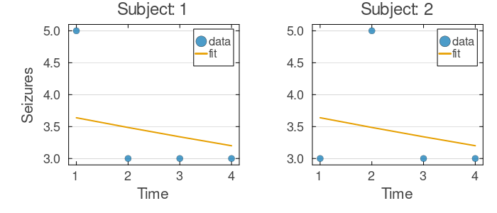
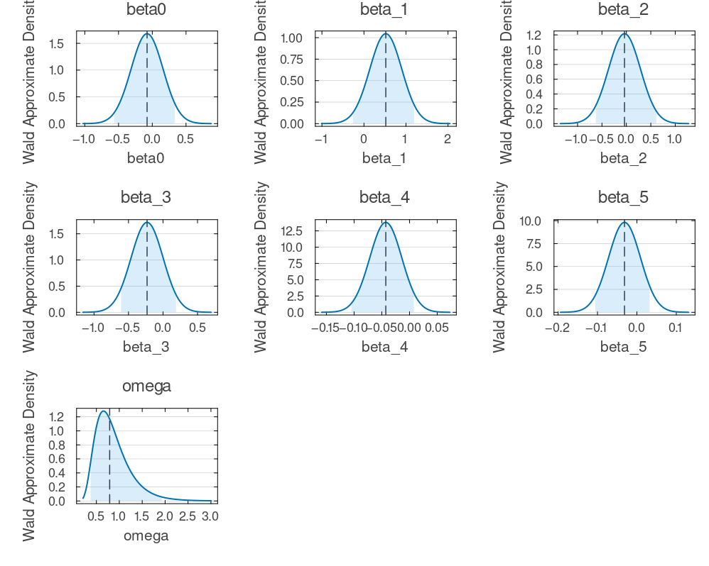
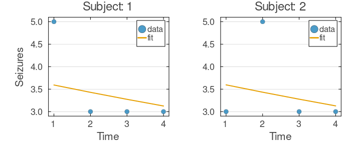
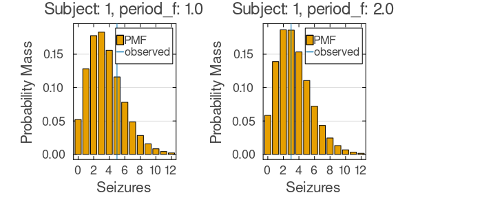
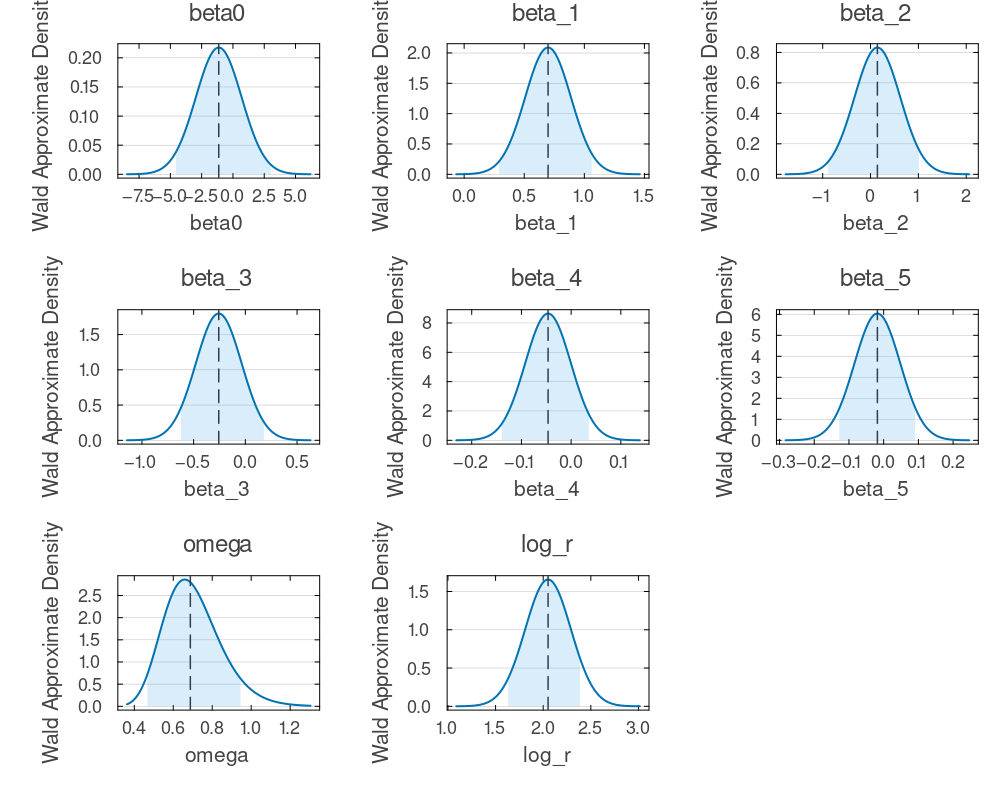

# Mixed-Effects Tutorial 5: Modeling Seizure Counts with Poisson and Negative Binomial Outcomes

Counting events over time -- seizures, infections, adverse reactions -- is one of the most common tasks in longitudinal clinical research. Yet count data behave very differently from continuous measurements. Counts are non-negative integers, their variance typically grows with their mean, and they are often right-skewed. Applying a Normal likelihood to such data can produce negative predicted counts, biased standard errors, and misleading inferences. The Poisson and Negative Binomial distributions are the natural statistical models for these outcomes because they respect the discrete, non-negative nature of counts and link the variance directly to the mean.

In this tutorial, you will build and compare two nonlinear mixed-effects models for repeated seizure counts, using data from the Thall and Vail (1990) epilepsy trial. This trial is one of the most widely analyzed longitudinal count datasets in biostatistics: 59 epilepsy patients were randomized to either progabide or placebo, and seizure counts were recorded across four consecutive two-week periods following a baseline observation window. The dataset has become a benchmark for count regression methods because it exhibits substantial between-subject variability and overdispersion -- features that push simple Poisson models to their limits and motivate the Negative Binomial alternative.

Both models share the same fixed-effects covariates and subject-level random-effects structure; they differ only in the outcome distribution. The Poisson assumes the variance equals the mean, while the Negative Binomial introduces a dispersion parameter to accommodate extra-Poisson variation. Because the subject-specific random effect enters inside an exponential rate function, both models are nonlinear in the random effects. This nonlinearity means the marginal likelihood integral over random effects has no closed-form solution, making Monte Carlo Expectation-Maximization (MCEM) a natural estimation strategy.

## Learning Goals

By the end of this tutorial, you will be able to:

- **Prepare longitudinal count data** -- reshape the classic MASS `epil` dataset into the long format NoLimits expects, deriving subject-level covariates (baseline seizure rate, age, treatment) and time-varying design variables (period, treatment-by-period interaction).
- **Specify count regression models** -- define both a Poisson and a Negative Binomial mixed-effects model in NoLimits, each with a log-link linear predictor and a subject-level random intercept.
- **Estimate with MCEM** -- fit both models using Monte Carlo Expectation-Maximization, an algorithm that alternates between sampling random effects from their conditional distribution and optimizing the fixed-effects parameters.
- **Visualize model fit** -- generate fitted-trajectory plots and observation-level predictive distributions using `plot_fits` and `plot_observation_distributions`.
- **Quantify uncertainty** -- compute Wald-based confidence intervals with `compute_uq` and produce publication-ready summary tables with `NoLimits.summarize`.

## Step 1: Data Setup

In this step, you will load the MASS epilepsy dataset (`MASS::epil`, mirrored in Rdatasets) and reshape it into the long format that NoLimits expects, where each row represents one subject-period combination. Along the way, you will derive several analysis variables: a binary treatment indicator, log-transformed baseline seizure count and age (to stabilize the scale of the linear predictor), and a centered period variable that improves interpretability of the intercept. The treatment-by-period interaction term will allow you to test whether the treatment effect changes over the course of the trial.

```julia
using NoLimits
using CSV
using DataFrames
using Distributions
using Downloads
using LinearAlgebra
using Random
using SciMLBase

include(joinpath(@__DIR__, "_data_loaders.jl"))

Random.seed!(2026)

function build_epilepsy_long_df(tbl::DataFrame)
    df = DataFrame(
        Subject=Int.(tbl.subject),
        Period=Int.(tbl.period),
        Trt=string.(tbl.trt),
        Base=Int.(tbl.base),
        Age=Int.(tbl.age),
        seizures=Int.(tbl.y),
    )

    sort!(df, [:Subject, :Period])
    df.trt_active = ifelse.(df.Trt .== "progabide", 1.0, 0.0)
    df.base_log = log1p.(float.(df.Base))
    df.age_log = log1p.(float.(df.Age))
    df.period_f = float.(df.Period)
    df.period_centered = df.period_f .- 1.0
    df.trt_period_centered = df.trt_active .* df.period_centered

    return df
end

epil_df = load_epil()
df = build_epilepsy_long_df(epil_df)
first(df, 10)
```

<!-- injected:t5-dfhead -->
```text
10×12 DataFrame
 Row │ Subject  Period  Trt       Base   Age    seizures  trt_active  base_log  age_log  period_f  period_centered  trt_period_centered
     │ Int64    Int64   String15  Int64  Int64  Int64     Float64     Float64   Float64  Float64   Float64          Float64
─────┼──────────────────────────────────────────────────────────────────────────────────────────────────────────────────────────────────
   1 │       1       1  placebo      11     31         5         0.0   2.48491  3.46574       1.0              0.0                  0.0
   2 │       1       2  placebo      11     31         3         0.0   2.48491  3.46574       2.0              1.0                  0.0
   3 │       1       3  placebo      11     31         3         0.0   2.48491  3.46574       3.0              2.0                  0.0
   4 │       1       4  placebo      11     31         3         0.0   2.48491  3.46574       4.0              3.0                  0.0
   5 │       2       1  placebo      11     30         3         0.0   2.48491  3.43399       1.0              0.0                  0.0
   6 │       2       2  placebo      11     30         5         0.0   2.48491  3.43399       2.0              1.0                  0.0
   7 │       2       3  placebo      11     30         3         0.0   2.48491  3.43399       3.0              2.0                  0.0
   8 │       2       4  placebo      11     30         3         0.0   2.48491  3.43399       4.0              3.0                  0.0
   9 │       3       1  placebo       6     25         2         0.0   1.94591  3.2581        1.0              0.0                  0.0
  10 │       3       2  placebo       6     25         4         0.0   1.94591  3.2581        2.0              1.0                  0.0
```

## Step 2: Poisson Mixed-Effects Model

In this step, you will define the Poisson mixed-effects model. The core idea is a log-linear predictor: the log of the expected seizure rate is modeled as a linear combination of covariates plus a subject-level random intercept. The random effect `eta` captures unmeasured between-subject heterogeneity in baseline seizure propensity. Because `eta` appears inside the exponential that maps the log-rate to the Poisson intensity parameter `lambda`, the model is nonlinear in the random effects -- a key reason MCEM is preferred over simpler estimation methods such as the Laplace approximation.

Note the two helper functions defined in the `@helpers` block: `linpred` computes the dot product of the covariate vector with the coefficient vector (keeping the model specification clean), and `safe_exp` guards against numerical overflow in the exponential.

```julia
model_poisson = @Model begin
    @helpers begin
        safe_exp(x) = exp(clamp(x, -20.0, 20.0))
        linpred(x, β) = dot(
            [x.base_log, x.age_log, x.trt_active, x.period_centered, x.trt_period_centered],
            β,
        )
    end

    @covariates begin
        period_f = Covariate()
        x = CovariateVector([:base_log, :age_log, :trt_active, :period_centered, :trt_period_centered])
    end

    @fixedEffects begin
        beta0 = RealNumber(0.1, calculate_se=true)
        beta = RealVector([0.5, -0.1, -0.2, -0.05, -0.04], calculate_se=true)
        omega = RealNumber(0.5, scale=:log, calculate_se=true)
    end

    @randomEffects begin
        eta = RandomEffect(Normal(0.0, omega); column=:Subject)
    end

    @formulas begin
        log_rate = beta0 + linpred(x, beta) + eta
        lambda = safe_exp(log_rate)
        seizures ~ Poisson(lambda)
    end
end

NoLimits.summarize(model_poisson)
```

<!-- injected:t5-modelp -->
```text
ModelSummary
════════════════════════════════════════════════════════════════════════════════════════════════
Overview
  model type                          : non-ODE
  fixed-effect blocks                 : 3
  fixed-effect scalar values          : 7
  random effects                      : 1
  random-effect grouping columns      : 1
  covariates (declared)               : 2
  formulas (deterministic / outcomes) : 2 / 1
  requires DE accessors               : false

Structure blocks
  helpers              : true
  fixed effects        : true
  random effects       : true
  covariates           : true
  preDE                : false
  DifferentialEquation : false
  initialDE            : false

Covariate classes
  varying  : 2
  constant : 0
  dynamic  : 0

Fixed-effects declarations
  name   type        size  se  prior      scale       bounds                              details
  ------------------------------------------------------------------------------------------------------------
  beta0  RealNumber     1  yes  Priorless  identity    finite lower 0/1, finite upper 0/1  -
  beta   RealVector     5  yes  Priorless  identityx5  finite lower 0/5, finite upper 0/5  -
  omega  RealNumber     1  yes  Priorless  log         finite lower 1/1, finite upper 0/1  -

Random-effects declarations
  name  group    dist  
  -----------------------
  eta   Subject  Normal

Covariate declarations
  name      kind             columns                   constant_on           interpolation
  -------------------------------------------------------------------------------------------------
  period_f  Covariate        period_f                  -                     -
  x         CovariateVector  base_log, age_log, trt_active, period_centered, trt_period_centered  -                     -

Formulas
  deterministic names : log_rate, lambda
  outcome names       : seizures
  required DE states  : (none)
  required DE signals : (none)
  declared DE states  : (none)
  declared DE signals : (none)
Outcome distribution types
  seizures => Poisson

Helper functions
  names : safe_exp, linpred
```

### Build `DataModel` and Configure `MCEM`

Next, you will bind the model to the data by constructing a `DataModel`. This step validates that all required columns are present and correctly typed, groups observations by subject, and prepares the internal data structures for estimation.

You will then configure the MCEM algorithm. The `sample_schedule` controls how many MCMC samples are drawn from the conditional distribution of the random effects at each EM iteration -- starting with fewer samples and increasing over iterations improves computational efficiency. The settings here are intentionally compact for documentation purposes; in practice, you would use more iterations and larger sample sizes for production analyses.

```julia
dm_poisson = DataModel(model_poisson, df; primary_id=:Subject, time_col=:period_f)

mcem_method = NoLimits.MCEM(;
    maxiters=4,
    sample_schedule=i -> min(20 + 10 * (i - 1), 60),
    turing_kwargs=(n_samples=20, n_adapt=10, progress=false),
    optim_kwargs=(maxiters=80,),
    progress=false,
)

serialization = SciMLBase.EnsembleThreads()

NoLimits.summarize(dm_poisson)
```

<!-- injected:t5-dmp -->
```text
DataModelSummary
════════════════════════════════════════════════════════════════════════════════════════════════
Overview
  model type                 : non-ODE
  event-aware                : false
  individuals                : 59
  rows (total / obs / event) : 236 / 236 / 0
  fixed effects (top-level)  : 3
  outcomes                   : 1
  covariates (declared)      : 2
  random effects             : 1

Covariate classes
  varying  : 2
  constant : 0
  dynamic  : 0

Outcome distribution types
  seizures => Poisson

Random-effect distribution types
  eta => Normal

Individual design diagnostics
  individuals with one observation              : 0
  global observed time range                    : 1.0 to 4.0
  unique observed time points                   : 4
  duplicate (ID, time) observation rows         : 0
  monotonic-time violations (observation order) : 0

Observations per individual
  metric       n          mean            sd           min           q25        median           q75           max
  ----------------------------------------------------------------------------------------------------------------
  count       59           4.0           0.0           4.0           4.0           4.0           4.0           4.0

Time span per individual
  metric       n          mean            sd           min           q25        median           q75           max
  ----------------------------------------------------------------------------------------------------------------
  span        59           3.0           0.0           3.0           3.0           3.0           3.0           3.0

Median sampling interval per individual
  metric          n          mean            sd           min           q25        median           q75           max
  -------------------------------------------------------------------------------------------------------------------
  median_dt      59           1.0           0.0           1.0           1.0           1.0           1.0           1.0

Outcome descriptive statistics (observation rows)
  Variable       n          mean            sd           min           q25        median           q75           max
  ------------------------------------------------------------------------------------------------------------------
  seizures     236        8.2627       12.3302           0.0          2.75           4.0           9.0         102.0

Declared covariates
  name      kind             columns
  -----------------------------------------------
  period_f  Covariate        period_f
  x         CovariateVector  base_log, age_log, trt_active, period_centered, trt_period_centered

Covariate descriptive statistics (observation rows)
  Variable                    n          mean            sd           min           q25        median           q75           max
  -------------------------------------------------------------------------------------------------------------------------------
  period_f.period_f         236           2.5         1.118           1.0          1.75           2.5          3.25           4.0
  x.base_log                236        3.2071        0.7117        1.9459        2.5649        3.1355        3.7377        5.0239
  x.age_log                 236        3.3561        0.2141        2.9444        3.1781        3.3673        3.4965        3.7612
  x.trt_active              236        0.5254        0.4994           0.0           0.0           1.0           1.0           1.0
  x.period_centered         236           1.5         1.118           0.0          0.75           1.5          2.25           3.0
  x.trt_period_centered     236        0.7881        1.1036           0.0           0.0           0.0           2.0           3.0

Per-random-effect summary
  random effect  group    dist      levels  rows/level min        median           max
  ----------------------------------------------------------------------------------
  eta            Subject  Normal        59             4.0           4.0           4.0
```

### Fit, Summarize, Plot, and UQ (Poisson)

You are now ready to fit the Poisson model. The `fit_model` call runs the full MCEM loop: at each iteration, it samples random effects conditional on the current fixed-effects estimates, then updates the fixed effects by maximizing the Monte Carlo approximation to the marginal likelihood. After fitting, you will inspect a summary of the estimated parameters.

```julia
res_poisson = fit_model(
    dm_poisson,
    mcem_method;
    serialization=serialization,
    rng=Random.Xoshiro(21),
)

NoLimits.summarize(res_poisson)
```

<!-- injected:t5-resp -->
```text
FitResultSummary
════════════════════════════════════════════════════════════════════════════════════════════════
Overview
  method                              : mcem
  inference                           : frequentist
  scale                               : natural
  objective                           : -676.3986
  iterations                          : 4
  parameters shown (reported / total) : 7 / 7

Parameter estimates
  parameter      Estimate
  -----------------------
  beta0           -0.0769
  beta_1           0.5199
  beta_2          -0.0385
  beta_3          -0.2307
  beta_4          -0.0428
  beta_5          -0.0315
  omega            0.7901

Outcome data coverage
  outcome        n_obs   n_missing
  --------------------------------
  seizures         236           0
  TOTAL            236           0

Empirical Bayes random effects summary (across RE levels)
  random effect       n          mean            sd           q25        median           q75
  ---------------------------------------------------------------------------
  eta                59        0.3579        0.6502        0.0455        0.2804        0.6631
```

To assess how well the model captures individual seizure trajectories, you will now plot fitted values against observed data for the first two subjects. The observation-distribution diagnostic reveals the full predictive distribution at selected time points -- a particularly informative view for count data, where the shape of the distribution (not just its mean) carries clinical significance.

```julia
p_fit_poisson = plot_fits(
    res_poisson;
    observable=:seizures,
    individuals_idx=[1, 2],
    ncols=2,
    shared_x_axis=true,
    shared_y_axis=true,
)

p_obs_poisson = plot_observation_distributions(
    res_poisson;
    observables=:seizures,
    individuals_idx=1,
    obs_rows=[1, 2],
)

p_fit_poisson
```

<!-- injected:t5-pfitp -->


Display the observation-distribution plot to examine the predicted probability mass function at individual time points.

```julia
p_obs_poisson
```

<!-- injected:t5-pobsp -->


Next, you will compute Wald-based confidence intervals for the fixed-effects parameters. The Wald method uses the curvature of the log-likelihood at the optimum to approximate the sampling distribution of each parameter estimate, yielding standard errors and 95% confidence intervals without requiring additional model fits.

```julia
uq_poisson = compute_uq(
    res_poisson;
    method=:wald,
    n_draws=100,
    level=0.95,
    rng=Random.Xoshiro(151),
)

NoLimits.summarize(uq_poisson)
```

<!-- injected:t5-uqp -->
```text
UQResultSummary
════════════════════════════════════════════════════════════════════════════════════════════════
Overview
  backend                             : wald
  source_method                       : mcem
  inference                           : frequentist
  scale                               : natural
  objective                           : -
  interval level                      : 0.95
  parameters shown (reported / total) : 7 / 7

Parameter uncertainty summary
  parameter      Estimate    Std. Error      CI Lower      CI Upper
  ---------------------------------------------------
  beta0           -0.0769        0.2511       -0.5655        0.3351
  beta_1           0.5199         0.404       -0.2619        1.1926
  beta_2          -0.0385        0.3491       -0.6245        0.6125
  beta_3          -0.2307        0.2097       -0.6067         0.189
  beta_4          -0.0428        0.0284       -0.1046        0.0077
  beta_5          -0.0315        0.0379       -0.1057        0.0322
  omega            0.7901        0.4303        0.3728        1.9309
```

For a consolidated view, combine the parameter estimates and their uncertainty into a single summary table -- the format most convenient for reporting in manuscripts and presentations.

```julia
NoLimits.summarize(res_poisson, uq_poisson)
```

<!-- injected:t5-resuqp -->
```text
UQResultSummary
════════════════════════════════════════════════════════════════════════════════════════════════
Overview
  backend                             : wald
  source_method                       : mcem
  inference                           : frequentist
  scale                               : natural
  objective                           : -676.3986
  interval level                      : 0.95
  parameters shown (reported / total) : 7 / 7

Parameter uncertainty summary
  parameter      Estimate    Std. Error      CI Lower      CI Upper
  ---------------------------------------------------
  beta0           -0.0769        0.2511       -0.5655        0.3351
  beta_1           0.5199         0.404       -0.2619        1.1926
  beta_2          -0.0385        0.3491       -0.6245        0.6125
  beta_3          -0.2307        0.2097       -0.6067         0.189
  beta_4          -0.0428        0.0284       -0.1046        0.0077
  beta_5          -0.0315        0.0379       -0.1057        0.0322
  omega            0.7901        0.4303        0.3728        1.9309

Outcome data coverage
  outcome        n_obs   n_missing
  --------------------------------
  seizures         236           0
  TOTAL            236           0

Empirical Bayes random effects summary (across RE levels)
  random effect       n          mean            sd           q25        median           q75
  ---------------------------------------------------------------------------
  eta                59        0.3579        0.6502        0.0455        0.2804        0.6631
```

Finally, visualize the approximate sampling distributions of the fixed-effects parameters implied by the Wald approximation.

```julia
plot_uq_distributions(uq_poisson)
```

<!-- injected:t5-puqp -->


## Step 3: Negative Binomial Mixed-Effects Model

The Poisson model assumes that the conditional variance of seizure counts equals the conditional mean. In practice, count data from clinical trials frequently exhibit *overdispersion* -- more variability than the Poisson predicts -- due to unmeasured heterogeneity beyond what the random intercept alone can capture. The Negative Binomial distribution addresses this limitation by introducing an additional dispersion parameter `r` (sometimes called the "size" or "shape" parameter). As `r` grows large, the Negative Binomial converges to the Poisson; smaller values of `r` indicate greater overdispersion. This makes the Negative Binomial a strict generalization of the Poisson, and comparing the two reveals whether overdispersion is a meaningful feature of the data.

In this step, you will define the Negative Binomial model. It retains the same structural predictor and random-effects hierarchy as the Poisson model above. The only additions are the dispersion parameter `log_r` (estimated on the log scale to ensure positivity) and the formula lines that convert the mean-scale rate `lambda` and size `r` into the `(r, p)` parameterization expected by `Distributions.NegativeBinomial`.

```julia
model_nb = @Model begin
    @helpers begin
        safe_exp(x) = exp(clamp(x, -20.0, 20.0))
        linpred(x, β) = dot(
            [x.base_log, x.age_log, x.trt_active, x.period_centered, x.trt_period_centered],
            β,
        )
    end

    @covariates begin
        period_f = Covariate()
        x = CovariateVector([:base_log, :age_log, :trt_active, :period_centered, :trt_period_centered])
    end

    @fixedEffects begin
        beta0 = RealNumber(0.1, calculate_se=true)
        beta = RealVector([0.5, -0.1, -0.2, -0.05, -0.04], calculate_se=true)
        omega = RealNumber(0.5, scale=:log, calculate_se=true)
        log_r = RealNumber(log(5.0), calculate_se=true)
    end

    @randomEffects begin
        eta = RandomEffect(Normal(0.0, omega); column=:Subject)
    end

    @formulas begin
        log_rate = beta0 + linpred(x, beta) + eta
        lambda = safe_exp(log_rate)
        r = exp(log_r) + 1e-6
        p = clamp(r / (r + lambda), 1e-8, 1.0 - 1e-8)
        seizures ~ NegativeBinomial(r, p)
    end
end

NoLimits.summarize(model_nb)
```

<!-- injected:t5-modelnb -->
```text
ModelSummary
════════════════════════════════════════════════════════════════════════════════════════════════
Overview
  model type                          : non-ODE
  fixed-effect blocks                 : 4
  fixed-effect scalar values          : 8
  random effects                      : 1
  random-effect grouping columns      : 1
  covariates (declared)               : 2
  formulas (deterministic / outcomes) : 4 / 1
  requires DE accessors               : false

Structure blocks
  helpers              : true
  fixed effects        : true
  random effects       : true
  covariates           : true
  preDE                : false
  DifferentialEquation : false
  initialDE            : false

Covariate classes
  varying  : 2
  constant : 0
  dynamic  : 0

Fixed-effects declarations
  name   type        size  se  prior      scale       bounds                              details
  ------------------------------------------------------------------------------------------------------------
  beta0  RealNumber     1  yes  Priorless  identity    finite lower 0/1, finite upper 0/1  -
  beta   RealVector     5  yes  Priorless  identityx5  finite lower 0/5, finite upper 0/5  -
  omega  RealNumber     1  yes  Priorless  log         finite lower 1/1, finite upper 0/1  -
  log_r  RealNumber     1  yes  Priorless  identity    finite lower 0/1, finite upper 0/1  -

Random-effects declarations
  name  group    dist  
  -----------------------
  eta   Subject  Normal

Covariate declarations
  name      kind             columns                   constant_on           interpolation
  -------------------------------------------------------------------------------------------------
  period_f  Covariate        period_f                  -                     -
  x         CovariateVector  base_log, age_log, trt_active, period_centered, trt_period_centered  -                     -

Formulas
  deterministic names : log_rate, lambda, r, p
  outcome names       : seizures
  required DE states  : (none)
  required DE signals : (none)
  declared DE states  : (none)
  declared DE signals : (none)
Outcome distribution types
  seizures => NegativeBinomial

Helper functions
  names : safe_exp, linpred
```

### Build `DataModel`, Fit, Summarize, Plot, and UQ (Negative Binomial)

You will now follow the same workflow as for the Poisson model: construct the `DataModel`, fit with identical MCEM settings, and inspect the results. Using the same algorithm configuration for both models ensures that any differences in fit quality reflect genuine differences in model adequacy rather than tuning artifacts.

```julia
dm_nb = DataModel(model_nb, df; primary_id=:Subject, time_col=:period_f)

res_nb = fit_model(
    dm_nb,
    mcem_method;
    serialization=serialization,
    rng=Random.Xoshiro(22),
)

NoLimits.summarize(dm_nb)
NoLimits.summarize(res_nb)
```

<!-- injected:t5-resnb -->
```text
FitResultSummary
════════════════════════════════════════════════════════════════════════════════════════════════
Overview
  method                              : mcem
  inference                           : frequentist
  scale                               : natural
  objective                           : -645.9053
  iterations                          : 4
  parameters shown (reported / total) : 8 / 8

Parameter estimates
  parameter      Estimate
  -----------------------
  beta0           -1.1335
  beta_1           0.6983
  beta_2            0.143
  beta_3          -0.2572
  beta_4          -0.0464
  beta_5          -0.0181
  omega            0.6876
  log_r            2.0511

Outcome data coverage
  outcome        n_obs   n_missing
  --------------------------------
  seizures         236           0
  TOTAL            236           0

Empirical Bayes random effects summary (across RE levels)
  random effect       n          mean            sd           q25        median           q75
  ---------------------------------------------------------------------------
  eta                59        0.2344        0.5379       -0.0228        0.2442          0.43
```

Generate the same fitted-trajectory and observation-distribution diagnostics as before. Comparing these plots side-by-side with the Poisson versions will reveal whether the Negative Binomial's wider predictive intervals better capture the observed variability in seizure counts.

```julia
p_fit_nb = plot_fits(
    res_nb;
    observable=:seizures,
    individuals_idx=[1, 2],
    ncols=2,
    shared_x_axis=true,
    shared_y_axis=true,
)

p_obs_nb = plot_observation_distributions(
    res_nb;
    observables=:seizures,
    individuals_idx=1,
    obs_rows=[1, 2],
)

p_fit_nb
```

<!-- injected:t5-pfitnb -->


Display the Negative Binomial observation-distribution plot for direct comparison with the Poisson version above. Pay attention to the width of the predicted probability mass -- the Negative Binomial should assign more probability to extreme counts.

```julia
p_obs_nb
```

<!-- injected:t5-pobsnb -->


Compute Wald-based uncertainty for the Negative Binomial model and produce both standalone and combined summary tables, following the same procedure as for the Poisson fit.

```julia
uq_nb = compute_uq(
    res_nb;
    method=:wald,
    n_draws=100,
    level=0.95,
    rng=Random.Xoshiro(152),
)

NoLimits.summarize(uq_nb)
NoLimits.summarize(res_nb, uq_nb)
```

<!-- injected:t5-resuqnb -->
```text
UQResultSummary
════════════════════════════════════════════════════════════════════════════════════════════════
Overview
  backend                             : wald
  source_method                       : mcem
  inference                           : frequentist
  scale                               : natural
  objective                           : -645.9053
  interval level                      : 0.95
  parameters shown (reported / total) : 8 / 8

Parameter uncertainty summary
  parameter      Estimate    Std. Error      CI Lower      CI Upper
  ---------------------------------------------------
  beta0           -1.1335        1.8818       -4.5512        3.0523
  beta_1           0.6983        0.2004        0.2894        1.0615
  beta_2            0.143         0.487       -0.8916        1.0095
  beta_3          -0.2572        0.2114       -0.6218        0.1798
  beta_4          -0.0464        0.0451       -0.1395        0.0356
  beta_5          -0.0181        0.0613       -0.1276        0.0905
  omega            0.6876        0.1361        0.4668        0.9454
  log_r            2.0511        0.2112        1.6316        2.3858

Outcome data coverage
  outcome        n_obs   n_missing
  --------------------------------
  seizures         236           0
  TOTAL            236           0

Empirical Bayes random effects summary (across RE levels)
  random effect       n          mean            sd           q25        median           q75
  ---------------------------------------------------------------------------
  eta                59        0.2344        0.5379       -0.0228        0.2442          0.43
```

The uncertainty distribution plots for the Negative Binomial model now include the dispersion parameter `log_r` -- a parameter with no counterpart in the Poisson model, whose magnitude directly quantifies the degree of overdispersion in the data.

```julia
plot_uq_distributions(uq_nb)
```

<!-- injected:t5-puqnb -->


## Step 4: Comparing Poisson and Negative Binomial Objectives

As a final diagnostic, you will compare the objective function values (negative log-likelihoods) from the two fits. A word of caution: because the Poisson is a limiting case of the Negative Binomial (as `r` tends to infinity) rather than a strict parameter restriction, these values are not directly comparable via a standard likelihood ratio test. Nevertheless, a substantially lower objective for the Negative Binomial strongly suggests that the data exhibit overdispersion the Poisson cannot accommodate. Formal model comparison for this class of count models would require information criteria (AIC, BIC) or cross-validation, which are beyond the scope of this tutorial.

```julia
(
    poisson_objective = NoLimits.get_objective(res_poisson),
    nb_objective = NoLimits.get_objective(res_nb),
)
```

<!-- injected:t5-obj -->
```text
(poisson_objective = -676.3985855275587, nb_objective = -645.9052503662361)
```

Keep in mind that these two objective values arise from different likelihood families. They provide a useful heuristic comparison, but definitive model selection requires the formal tools mentioned above.
