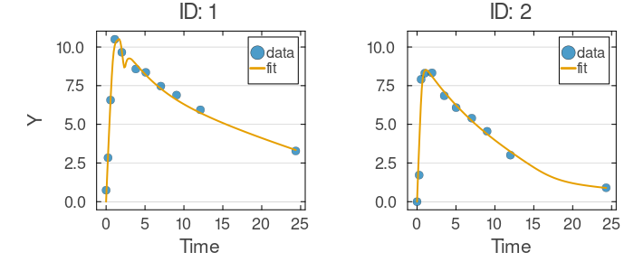
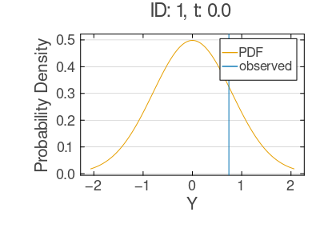

# Mixed-Effects Tutorial 4: SoftTree Differential-Equation Components (SAEM)

When building mechanistic models of longitudinal data, you often know the broad structure of the system -- compartments, conservation laws, transfer pathways -- but not the precise functional forms that govern how material moves between states. Neural networks are one way to learn those unknown rate functions from data, as shown in Tutorial 3. Soft decision trees offer an appealing alternative. They can approximate arbitrary nonlinear mappings, yet their branching structure provides built-in feature selection and piecewise-smooth approximation that is often easier to interpret. For the low-dimensional inputs typical of scientific rate functions (a single state variable, or time itself), soft trees can match neural network flexibility with substantially fewer parameters.

In this tutorial, you will build a mixed-effects ODE model in which soft decision trees parameterize the ODE right-hand side, then estimate the model with the Stochastic Approximation Expectation-Maximization (SAEM) algorithm. The model is structurally parallel to Tutorial 3, so you can directly compare the two function-approximation strategies on the same data and compartmental structure.

## Learning Goals

By the end of this tutorial, you will be able to:

- Declare `SoftTreeParameters` blocks that create differentiable decision trees whose flattened parameters join the fixed-effects vector, exposing callable functions (e.g., `STA1`) for use inside `@DifferentialEquation`.
- Wire multiple soft trees into a two-compartment transfer ODE, letting the trees learn unknown rate functions from data.
- Couple each tree's parameter vector to subject-level random effects via `MvNormal` distributions, giving every individual a personalized version of the dynamics.
- Fit the model with SAEM using its default settings, which remain stable even when the random-effect vectors are high-dimensional.
- Visualize individual-level trajectories and observation distributions to assess model adequacy.

## Step 1: Data Setup

In this step, you will load the Theophylline dataset used throughout these tutorials. The dataset records time-series measurements for 12 subjects and provides a clean example of two-compartment transfer dynamics: a substance enters a depot (input) compartment and moves to a central (observed) compartment, where it is measured and gradually cleared. You will reshape the data so that the initial amount `d` appears as a constant covariate for each subject.

```julia
using NoLimits
using CSV
using DataFrames
using Distributions
using Downloads
using Random
using LinearAlgebra
using OrdinaryDiffEq
using SciMLBase
using Turing

include(joinpath(@__DIR__, "_data_loaders.jl"))

Random.seed!(654)

theoph_df = load_theoph()

function build_theoph_non_event_df(tbl::DataFrame)
    df = DataFrame(
        ID=Int.(tbl.Subject),
        t=Float64.(tbl.Time),
        y=Float64.(tbl.conc),
        d=Float64.(tbl.Wt .* tbl.Dose),
    )
    sort!(df, [:ID, :t])
    return df
end

df = build_theoph_non_event_df(theoph_df)
first(df, 10)
```

<!-- injected:t4-dfhead -->
```text
10×4 DataFrame
 Row │ ID     t        y        d
     │ Int64  Float64  Float64  Float64
─────┼──────────────────────────────────
   1 │     1     0.0      0.74  319.992
   2 │     1     0.25     2.84  319.992
   3 │     1     0.57     6.57  319.992
   4 │     1     1.12    10.5   319.992
   5 │     1     2.02     9.66  319.992
   6 │     1     3.82     8.58  319.992
   7 │     1     5.1      8.36  319.992
   8 │     1     7.03     7.47  319.992
   9 │     1     9.05     6.89  319.992
  10 │     1    12.12     5.94  319.992
```

## Step 2: Define SoftTree-Driven ODE Mixed-Effects Model

In this step, you will construct the full mixed-effects model. The guiding idea is the same as in the neural ODE tutorial: rather than specifying closed-form rate laws, you let data-driven function approximators learn the rate functions directly from observations. The difference is the choice of approximator. Each `SoftTreeParameters` block declares a soft decision tree with a specified input dimension and depth. The `depth_st` parameter controls expressiveness -- a tree of depth `d` has `2^d` leaf nodes, each contributing a smooth local approximation. The block's flattened parameters become part of the fixed-effects vector, and the associated callable function (e.g., `STA1`) evaluates the tree at any input.

The ODE system wires four soft trees into a two-compartment transfer model:

- `fA1(t)` and `fA2(t)` govern the dynamics of the depot (input) compartment.
- `fC1(t)` and `fC2(t)` govern the dynamics of the central (observed) compartment.

To capture between-subject variability, each tree's parameter vector is paired with a subject-level random-effect vector drawn from an `MvNormal` distribution centered on the population parameters. This gives every individual a personalized version of the transfer dynamics while sharing structure across the population.

```julia
using NoLimits
using Distributions
using LinearAlgebra
using OrdinaryDiffEq

depth_st = 2

model_raw = @Model begin
    @helpers begin
        softplus(u) = u > 20 ? u : log1p(exp(u))
    end

    @covariates begin
        t = Covariate()
        d = ConstantCovariate(constant_on=:ID)
    end

    @fixedEffects begin
        sigma = RealNumber(1.0, scale=:log, prior=LogNormal(log(1.0), 0.5), calculate_se=true)

        gA1 = SoftTreeParameters(1, depth_st; function_name=:STA1, calculate_se=false)
        gA2 = SoftTreeParameters(1, depth_st; function_name=:STA2, calculate_se=false)
        gC1 = SoftTreeParameters(1, depth_st; function_name=:STC1, calculate_se=false)
        gC2 = SoftTreeParameters(1, depth_st; function_name=:STC2, calculate_se=false)
    end

    @randomEffects begin
        etaA1 = RandomEffect(MvNormal(gA1, Diagonal(ones(length(gA1)))); column=:ID)
        etaA2 = RandomEffect(MvNormal(gA2, Diagonal(ones(length(gA2)))); column=:ID)
        etaC1 = RandomEffect(MvNormal(gC1, Diagonal(ones(length(gC1)))); column=:ID)
        etaC2 = RandomEffect(MvNormal(gC2, Diagonal(ones(length(gC2)))); column=:ID)
    end

    @DifferentialEquation begin
        a_A(t) = softplus(depot)
        x_C(t) = softplus(center)

        fA1(t) = softplus(STA1([t / 24], etaA1)[1])
        fA2(t) = softplus(STA2([a_A(t)], etaA2)[1])
        fC1(t) = -softplus(STC1([x_C(t)], etaC1)[1])
        fC2(t) = softplus(STC2([t / 24], etaC2)[1])

        D(depot) ~ -d * fA1(t) - fA2(t)
        D(center) ~ d * fA1(t) + fA2(t) + fC1(t) + d * fC2(t)
    end

    @initialDE begin
        depot = d
        center = 0.0
    end

    @formulas begin
        y ~ Normal(center(t), sigma)
    end
end

model = set_solver_config(
    model_raw;
    saveat_mode=:saveat,
    alg=AutoTsit5(Rosenbrock23()),
    kwargs=(abstol=1e-2, reltol=1e-2),
)
```

Before moving on, inspect the assembled model to verify that all blocks -- covariates, fixed effects, random effects, ODE, and formulas -- are correctly wired together.

### Model Summary

```julia
model_summary = NoLimits.summarize(model)
model_summary
```

<!-- injected:t4-model -->
```text
ModelSummary
════════════════════════════════════════════════════════════════════════════════════════════════
Overview
  model type                          : ODE
  fixed-effect blocks                 : 5
  fixed-effect scalar values          : 41
  random effects                      : 4
  random-effect grouping columns      : 1
  covariates (declared)               : 2
  formulas (deterministic / outcomes) : 0 / 1
  requires DE accessors               : true

Structure blocks
  helpers              : true
  fixed effects        : true
  random effects       : true
  covariates           : true
  preDE                : false
  DifferentialEquation : true
  initialDE            : true

Covariate classes
  varying  : 1
  constant : 1
  dynamic  : 0

Fixed-effects declarations
  name   type                size  se  prior      scale  bounds                                details
  -----------------------------------------------------------------------------------------------------------------
  sigma  RealNumber             1  yes  LogNormal  log    finite lower 1/1, finite upper 0/1    -
  gA1    SoftTreeParameters    10  no  Priorless  n/a    finite lower 0/10, finite upper 0/10  function=STA1, input_dim=1, depth=2, outputs=1, weights=10
  gA2    SoftTreeParameters    10  no  Priorless  n/a    finite lower 0/10, finite upper 0/10  function=STA2, input_dim=1, depth=2, outputs=1, weights=10
  gC1    SoftTreeParameters    10  no  Priorless  n/a    finite lower 0/10, finite upper 0/10  function=STC1, input_dim=1, depth=2, outputs=1, weights=10
  gC2    SoftTreeParameters    10  no  Priorless  n/a    finite lower 0/10, finite upper 0/10  function=STC2, input_dim=1, depth=2, outputs=1, weights=10

Random-effects declarations
  name   group  dist    
  ------------------------
  etaA1  ID     MvNormal
  etaA2  ID     MvNormal
  etaC1  ID     MvNormal
  etaC2  ID     MvNormal

Covariate declarations
  name  kind               columns                   constant_on           interpolation
  -----------------------------------------------------------------------------------------------
  t     Covariate          t                         -                     -
  d     ConstantCovariate  d                         ID                    -

Formulas
  deterministic names : (none)
  outcome names       : y
  required DE states  : center
  required DE signals : (none)
  declared DE states  : depot, center
  declared DE signals : a_A, x_C, fA1, fA2, fC1, fC2
Outcome distribution types
  y => Normal

Helper functions
  names : softplus
```

## Step 3: Build `DataModel` and Configure SAEM

In this step, you will pair the model with the observed data by constructing a `DataModel`, then configure the SAEM fitting algorithm. SAEM alternates between two phases: an E-step that samples subject-level random effects conditional on the current population parameters, and an M-step that updates those population parameters using stochastic sufficient statistics. Here we use the default configuration, `NoLimits.SAEM()`. With its defaults, SAEM draws the random effects with the adaptive Metropolis sampler (`SaemixMH`) in the E-step and updates the population parameters with a stochastic-approximation (Robbins-Monro) M-step. No special configuration is required even though each tree's full parameter vector is individualized, so the random-effect dimension is high. Running with defaults keeps the example simple and parallel to the neural-ODE tutorial, making the two function-approximation strategies directly comparable.

```julia
dm = DataModel(model, df; primary_id=:ID, time_col=:t)

saem_method = NoLimits.SAEM()

serialization = SciMLBase.EnsembleThreads()
```

Before fitting, review the data model summary to confirm that individuals, covariates, and grouping structures were parsed as expected.

### DataModel Summary

```julia
dm_summary = NoLimits.summarize(dm)
dm_summary
```

<!-- injected:t4-dm -->
```text
DataModelSummary
════════════════════════════════════════════════════════════════════════════════════════════════
Overview
  model type                 : ODE
  event-aware                : false
  individuals                : 12
  rows (total / obs / event) : 132 / 132 / 0
  fixed effects (top-level)  : 5
  outcomes                   : 1
  covariates (declared)      : 2
  random effects             : 4

Covariate classes
  varying  : 1
  constant : 1
  dynamic  : 0

Outcome distribution types
  y => Normal

Random-effect distribution types
  etaA1 => MvNormal
  etaA2 => MvNormal
  etaC1 => MvNormal
  etaC2 => MvNormal

Individual design diagnostics
  individuals with one observation              : 0
  global observed time range                    : 0.0 to 24.65
  unique observed time points                   : 78
  duplicate (ID, time) observation rows         : 0
  monotonic-time violations (observation order) : 0

Observations per individual
  metric       n          mean            sd           min           q25        median           q75           max
  ----------------------------------------------------------------------------------------------------------------
  count       12          11.0           0.0          11.0          11.0          11.0          11.0          11.0

Time span per individual
  metric       n          mean            sd           min           q25        median           q75           max
  ----------------------------------------------------------------------------------------------------------------
  span        12       24.1992        0.2439          23.7         24.11        24.195        24.355         24.65

Median sampling interval per individual
  metric          n          mean            sd           min           q25        median           q75           max
  -------------------------------------------------------------------------------------------------------------------
  median_dt      12        1.5092        0.0277         1.445        1.4975        1.5075        1.5312          1.55

Outcome descriptive statistics (observation rows)
  Variable       n          mean            sd           min           q25        median           q75           max
  ------------------------------------------------------------------------------------------------------------------
  y            132        4.9605        2.8564           0.0        2.8775         5.275          7.14          11.4

Declared covariates
  name  kind               columns
  ---------------------------------------------
  t     Covariate          t
  d     ConstantCovariate  d

Covariate descriptive statistics (observation rows)
  Variable       n          mean            sd           min           q25        median           q75           max
  ------------------------------------------------------------------------------------------------------------------
  t.t          132        5.8946        6.8997           0.0         0.595          3.53           9.0         24.65
  d.d          132      315.4398       14.3601        267.84       319.365        319.84       319.994        320.65

Per-random-effect summary
  random effect  group  dist        levels  rows/level min        median           max
  ----------------------------------------------------------------------------------
  etaA1          ID     MvNormal        12            11.0          11.0          11.0
  etaA2          ID     MvNormal        12            11.0          11.0          11.0
  etaC1          ID     MvNormal        12            11.0          11.0          11.0
  etaC2          ID     MvNormal        12            11.0          11.0          11.0
```

## Step 4: Fit and Inspect Core Result Summary

In this step, you will run the SAEM algorithm and examine the results. With the default settings the algorithm iterates up to 300 times, drawing the random effects with the adaptive Metropolis sampler within each E-step. After fitting completes, you will extract the final objective value and parameter count as a quick sanity check before looking at more detailed diagnostics.

```julia
res_saem = fit_model(
    dm,
    saem_method;
    serialization=serialization,
    rng=Random.Xoshiro(31),
)

(
    objective=NoLimits.get_objective(res_saem),
    n_params=length(NoLimits.get_params(res_saem; scale=:untransformed)),
)
```

<!-- injected:t4-obj -->
```text
(objective = -644.2180056833639, n_params = 41)
```

For a more detailed view -- including parameter estimates and convergence diagnostics -- call the `summarize` function on the fit result.

```julia
fit_summary_saem = NoLimits.summarize(res_saem)
fit_summary_saem
```

<!-- injected:t4-fit -->
```text
FitResultSummary
════════════════════════════════════════════════════════════════════════════════════════════════
Overview
  method                              : saem
  inference                           : frequentist
  scale                               : natural
  objective                           : -644.218
  iterations                          : 300
  parameters shown (reported / total) : 1 / 41

Parameter estimates
  parameter      Estimate
  -----------------------
  sigma            0.8007

Outcome data coverage
  outcome       n_obs   n_missing
  -------------------------------
  y               132           0
  TOTAL           132           0

Empirical Bayes random effects summary (across RE levels)
  random effect  component       n          mean            sd           q25        median           q75
  --------------------------------------------------------------------------------------------------
  etaA1          etaA1_1        12       -6.2121        0.0165       -6.2156       -6.2091       -6.2049
  etaA1          etaA1_2        12        0.2045        0.0013        0.2043        0.2049        0.2051
  etaA1          etaA1_3        12        -6.082        0.0262       -6.0894       -6.0776       -6.0663
  etaA1          etaA1_4        12        0.0953        0.1622       -0.0429        0.1076         0.239
  etaA1          etaA1_5        12       -0.3611        0.0247       -0.3848       -0.3602       -0.3529
  etaA1          etaA1_6        12        0.7108        0.2609        0.4858        0.7068        0.9321
  etaA1          etaA1_7        12        -3.056        0.0829       -3.1323       -3.0567        -3.032
  etaA1          etaA1_8        12       -2.8938        0.1035       -2.9838        -2.899       -2.8348
  etaA1          etaA1_9        12       -3.5826        0.1173        -3.692       -3.5821       -3.5474
  etaA1          etaA1_10       12      -10.9092        0.0645      -10.9618       -10.916      -10.8406
  etaA2          etaA2_1        12        3.4375     0.0003838        3.4376        3.4376        3.4376
  etaA2          etaA2_2        12        3.6043     0.0009664        3.6042        3.6042        3.6042
  etaA2          etaA2_3        12       -0.3261      0.000696       -0.3258       -0.3258       -0.3258
  etaA2          etaA2_4        12       -0.2836     0.0005731       -0.2836       -0.2836       -0.2836
  etaA2          etaA2_5        12        -0.755     0.0002719       -0.7549       -0.7549       -0.7549
  etaA2          etaA2_6        12         0.531     0.0008075        0.5312        0.5312        0.5312
  etaA2          etaA2_7        12       -6.2415        0.0058       -6.2418       -6.2399       -6.2389
  etaA2          etaA2_8        12       -2.1397     0.0004757       -2.1398       -2.1398       -2.1398
  etaA2          etaA2_9        12        -0.972     0.0007101       -0.9723       -0.9723       -0.9723
  etaA2          etaA2_10       12        -0.636     0.0004774       -0.6361       -0.6361       -0.6361
  etaC1          etaC1_1        12        0.8958         0.204        0.7581        0.8743        0.9995
  etaC1          etaC1_2        12       -2.8836     0.0002293       -2.8837       -2.8837       -2.8837
  etaC1          etaC1_3        12        3.6256        0.0571        3.6013        3.6433        3.6607
  etaC1          etaC1_4        12       -7.8773        0.1271       -7.9085        -7.839       -7.7995
  etaC1          etaC1_5        12       -3.4996     0.0007315       -3.4995       -3.4995       -3.4995
  etaC1          etaC1_6        12       -4.8953        0.0377       -4.9055       -4.8822       -4.8729
  etaC1          etaC1_7        12        0.7981     0.0004352        0.7983        0.7983        0.7983
  etaC1          etaC1_8        12       -1.1394        0.2443       -1.1813       -1.1073       -0.9892
  etaC1          etaC1_9        12       18.5752        0.0914       18.5446        18.546        18.552
  etaC1          etaC1_10       12       -4.0926        0.0215       -4.0956       -4.0854       -4.0807
  etaC2          etaC2_1        12       -8.4274        0.0375       -8.4311       -8.4163       -8.4044
  etaC2          etaC2_2        12       -0.6066        0.0139       -0.6051       -0.6029       -0.5983
  etaC2          etaC2_3        12       -7.3788        0.0287       -7.3918       -7.3738       -7.3596
  etaC2          etaC2_4        12        1.2257        0.2273        1.0901         1.309        1.3944
  etaC2          etaC2_5        12        0.8212        0.1806        0.7094        0.7895        0.8212
  etaC2          etaC2_6        12        1.3779        0.2182        1.2705        1.4558         1.527
  etaC2          etaC2_7        12       -2.9319        0.4714       -3.2837        -2.962        -2.875
  etaC2          etaC2_8        12       -3.7047         0.096       -3.7676       -3.7057       -3.6357
  etaC2          etaC2_9        12       -4.0089        0.1493       -4.1276       -3.9947       -3.9501
  etaC2          etaC2_10       12      -12.3303         0.044      -12.3495      -12.3173         -12.3
```


## Step 5: Fitted Trajectories (First 2 Individuals)

In this step, you will overlay the model's predicted trajectories on the raw observations for the first two subjects. Plotting fitted curves against data provides an immediate visual assessment of model adequacy: do the predicted dynamics capture the timing and magnitude of the observed response?

```julia
p_fit_saem = plot_fits(
    res_saem;
    observable=:y,
    individuals_idx=[1, 2],
    ncols=2,
    shared_x_axis=true,
    shared_y_axis=true,
)

p_fit_saem
```

<!-- injected:t4-pfit -->


## Step 6: Observation Distribution Diagnostic

As a final check, you will examine the implied observation distribution at a single data point for the first individual. Rather than showing only a point prediction, this plot displays the full predictive distribution, letting you assess whether the residual variance is well-calibrated and the model's uncertainty envelope is reasonable.

```julia
p_obs_saem = plot_observation_distributions(
    res_saem;
    observables=:y,
    individuals_idx=1,
    obs_rows=1,
)

p_obs_saem
```

<!-- injected:t4-pobs -->


## Interpretation Notes

- This modeling pattern combines mechanistic compartmental structure with soft decision tree function approximators inside a single mixed-effects ODE. The compartments encode known domain knowledge (mass conservation, transfer pathways), while the trees learn the unknown rate functions from data. This separation means you retain interpretable system structure without needing to specify rate-law functional forms in advance.
- Compared to neural networks, soft trees can be more parameter-efficient for the low-dimensional inputs common in scientific rate functions, and their piecewise-smooth approximation may be easier to inspect post hoc. The choice between the two is problem-dependent; both can be embedded in the same NoLimits framework with minimal code changes (compare this tutorial with Tutorial 3).
- Default SAEM (`NoLimits.SAEM()`) is sufficient here: the adaptive Metropolis E-step and stochastic-approximation M-step remain stable even when the individualized parameter vectors are high-dimensional. When defaults are not enough, SAEM also exposes closed-form Gaussian block updates through `builtin_stats=:closed_form` together with the `re_mean_params` mapping.
- The structural settings in this tutorial (tree depth, ODE solver tolerances) are intentionally modest to keep runtime short. For production analyses, consider deeper trees, increasing `maxiters` and the number of MCMC samples to ensure thorough convergence, and tightening the ODE solver tolerances.
